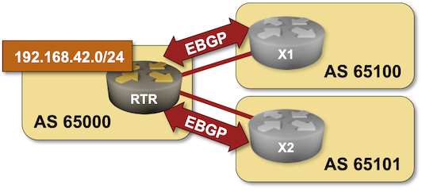

# Advertise IPv4 Prefixes to BGP Neighbors

In the [previous lab exercise](2-multihomed.md) you configured EBGP sessions with two routers belonging to upstream ISPs. Now it's time to advertise your address space (IPv4 prefixes) to them so you'll start receiving some traffic.



The routers in your lab use the following BGP AS numbers. Each upstream router advertises its loopback, another IPv4 prefix, and the default route.

| Node/ASN | Router ID | Advertised prefixes |
|----------|----------:|--------------------:|
| **AS65000** ||
| rtr | 10.0.0.1 | |
| **AS65100** ||
| x1 | 10.0.0.10 | 10.0.0.10/32<br>192.168.100.0/24 |
| **AS65101** ||
| x2 | 10.0.0.11 | 10.0.0.11/32<br>192.168.101.0/24 |

Your router has these EBGP neighbors. _netlab_ configures them automatically, if you're using some other lab infrastructure you'll have to configure them manually.

| Node | Neighbor | Neighbor IPv4 | Neighbor AS |
|------|----------|--------------:|------------:|
| rtr | x1 | 10.1.0.2 | 65100 |
| rtr | x2 | 10.1.0.6 | 65101 |

## Start the Lab

Assuming you already [set up your lab infrastructure](../1-setup.md):

* Change directory to `basic/3-originate`
* Execute **netlab up** ([other options](../external/index.md))
* Log into your device (RTR) with **netlab connect rtr** and verify IP addresses and basic BGP configuration.

**Note:** *netlab* will configure IP addressing and EBGP sessions on your router. If you're not using *netlab* just continue with the configuration you made during the [previous exercise](2-multihomed.md).

## Configuration Tasks

You have to advertise two prefixes to the upstream providers:

* `192.168.42.0` -- the IP address space belonging to your organization
* `10.0.0.1` -- your loopback IP address.

!!! Warning
    This is a lab exercise and we're using a loopback IP address just to have a directly-connected subnet you can advertise. You should NEVER advertise your loopback addresses (or any other prefix more specific than a /24) to the public Internet. 

BGP never originates IP prefixes without being told to do so. The usual ways to do that are:

1. Redistribution of other sources of routing information into BGP -- for example, redistributing directly connected subnets or OSPF routes.
2. Origination of configured prefixes, often using **network** router configuration command. This approach assumes *there's an exact match in the IP routing table*

While the first method is usually used within enterprise networks using BGP as an internal routing protocol or to connect to an MPLS/VPN service, you should have a tight control over the prefixes advertised into the public Internet. Please use the second method in this lab exercise.

!!! Warning
    If your device happens to be [fully compliant with RFC 8212](https://blog.ipspace.net/2023/06/default-ebgp-policy-rfc-8212.html) (example: Cisco IOS XR), you'll have to configure a *permit everything* outgoing filter on all EBGP neighbors or your device won't send them anything.

## Verification

The IPv4 prefixes you want to advertise to EBGP neighbors have to be in the BGP table of your router first. A command similar to **show ip bgp** is thus a good starting point. This is how Arista EOS displays it:

```
rtr>show ip bgp
BGP routing table information for VRF default
Router identifier 10.0.0.1, local AS number 65000
Route status codes: s - suppressed contributor, * - valid, > - active, E - ECMP head, e - ECMP
                    S - Stale, c - Contributing to ECMP, b - backup, L - labeled-unicast
                    % - Pending BGP convergence
Origin codes: i - IGP, e - EGP, ? - incomplete
RPKI Origin Validation codes: V - valid, I - invalid, U - unknown
AS Path Attributes: Or-ID - Originator ID, C-LST - Cluster List, LL Nexthop - Link Local Nexthop

          Network                Next Hop              Metric  AIGP       LocPref Weight  Path
 * >      0.0.0.0/0              10.1.0.2              0       -          100     0       65100 i
 *        0.0.0.0/0              10.1.0.6              0       -          100     0       65101 i
 * >      10.0.0.1/32            -                     -       -          -       0       i
 * >      10.0.0.10/32           10.1.0.2              0       -          100     0       65100 i
 * >      10.0.0.11/32           10.1.0.6              0       -          100     0       65101 i
 * >      192.168.42.0/24        -                     -       -          -       0       ?
 * >      192.168.100.0/24       10.1.0.2              0       -          100     0       65100 i
 * >      192.168.101.0/24       10.1.0.6              0       -          100     0       65101 i
```

However, you really want to know if the prefixes are advertised to the EBGP neighbors. Some network devices have a **show** command that displays prefixes advertised to a neighbor. Here's how that command works on Arista EOS:

```
rtr>show ip bgp neighbor 10.1.0.2 advertised-routes
BGP routing table information for VRF default
Router identifier 10.0.0.1, local AS number 65000
Route status codes: s - suppressed contributor, * - valid, > - active, E - ECMP head, e - ECMP
                    S - Stale, c - Contributing to ECMP, b - backup, L - labeled-unicast, q - Queued for advertisement
                    % - Pending BGP convergence
Origin codes: i - IGP, e - EGP, ? - incomplete
RPKI Origin Validation codes: V - valid, I - invalid, U - unknown
AS Path Attributes: Or-ID - Originator ID, C-LST - Cluster List, LL Nexthop - Link Local Nexthop

          Network                Next Hop              Metric  AIGP       LocPref Weight  Path
 * >      10.0.0.1/32            10.1.0.1              -       -          -       -       65000 i
 * >      10.0.0.11/32           10.1.0.1              -       -          -       -       65000 65101 i
 * >      192.168.42.0/24        10.1.0.1              -       -          -       -       65000 ?
 * >      192.168.101.0/24       10.1.0.1              -       -          -       -       65000 65101 i
```

You should check the BGP table on the remote router to be absolutely sure everything is OK. While that's a bit hard to do in real life (unless your ISP offers a [looking glass](https://en.wikipedia.org/wiki/Looking_Glass_server)), it's way easier in a lab -- connect to X1 or X2 with **netlab connect** (or SSH into them if you're not using _netlab_), start `vtysh` and execute the **show ip bgp** command:

```
$ netlab connect x1
Connecting to container clab-originate-x1, starting bash
Use vtysh to connect to FRR daemon

x1(bash)#sudo vtysh

Hello, this is FRRouting (version 7.5+cl4.4.0u4).
Copyright 1996-2005 Kunihiro Ishiguro, et al.

x1# show ip bgp
BGP table version is 6, local router ID is 10.0.0.10, vrf id 0
Default local pref 100, local AS 65100
Status codes:  s suppressed, d damped, h history, * valid, > best, = multipath,
               i internal, r RIB-failure, S Stale, R Removed
Nexthop codes: @NNN nexthop's vrf id, < announce-nh-self
Origin codes:  i - IGP, e - EGP, ? - incomplete

   Network          Next Hop            Metric LocPrf Weight Path
*> 10.0.0.1/32      10.1.0.1                               0 65000 i
*> 10.0.0.10/32     0.0.0.0                  0         32768 i
*> 10.0.0.11/32     10.1.0.1                               0 65000 65101 i
*> 192.168.42.0/24  10.1.0.1                               0 65000 ?
*> 192.168.100.0/24 0.0.0.0                  0         32768 i
*> 192.168.101.0/24 10.1.0.1                               0 65000 65101 i

Displayed  6 routes and 6 total paths
x1#
```

**Next:**

* (Optional) [Configure BGP for IPv6](4-ipv6.md)
* Use BGP weights to [prefer one of the upstream ISPs](../policy/1-weights.md).

## Reference Information

You might find the following information useful if you're not using _netlab_ to build the lab:

### Lab Wiring

This lab uses a subset of the [4-router lab topology](../external/4-router.md):

| Origin Device | Origin Port | Destination Device | Destination Port |
|---------------|-------------|--------------------|------------------|
| rtr | Ethernet1 | x1 | swp1 |
| rtr | Ethernet2 | x2 | swp1 |

### Lab Addressing

| Node/Interface | IPv4 Address | IPv6 Address | Description |
|----------------|-------------:|-------------:|-------------|
| **rtr** |  10.0.0.1/32 |  | Loopback |
| Ethernet1 | 10.1.0.1/30 |  | rtr -> x1 |
| Ethernet2 | 10.1.0.5/30 |  | rtr -> x2 |
| **x1** |  10.0.0.10/32 |  | Loopback |
| swp1 | 10.1.0.2/30 |  | x1 -> rtr |
| **x2** |  10.0.0.11/32 |  | Loopback |
| swp1 | 10.1.0.6/30 |  | x2 -> rtr |

