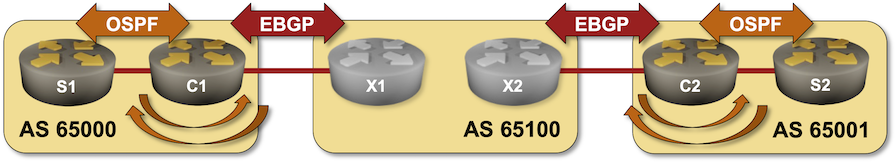
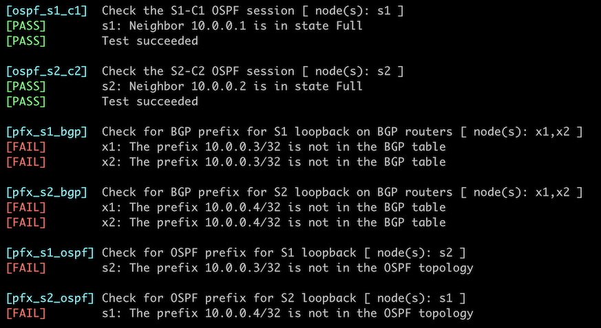

# Redistribute IGP Information Into BGP

When using BGP to connect to the public Internet, you should advertise the minimum number of prefixes needed to make your site reachable from the Internet -- the best approach is to configure the prefixes you want to advertise as you did in the [Advertise IPv4 Prefixes to BGP Neighbors](3-originate.md) lab exercise. That makes little sense when using BGP as a generic routing protocol, for example, when connecting your sites to an MPLS/VPN service. In these scenarios, it's better to redistribute local routing information (connected subnets, static routes, and IGP routes) into the BGP table; you'll practice the route redistribution approach in this exercise.

Your lab has two sites connected to an MPLS/VPN provider. Each site has a WAN edge router and a core router, running OSPF between them. Your WAN edge routers run BGP with the provider edge routers.



In this lab exercise, you must establish connectivity between your sites so that the site routers (S1 and S2) can ping each other.

## Lab Configuration

If you're using *netlab, *you'll start with a preconfigured lab -- *netlab* will configure IP addressing, OSPF routing, and EBGP sessions. If you're using any other lab environment, you'll have to configure all of that manually. The following tables describe the OSPF and BGP setup; the _[Reference Information](#alt)_ section contains IP addressing information.

### BGP Routers and AS Numbers

| Node/ASN | Router ID | Advertised prefixes |
|----------|----------:|--------------------:|
| **AS65000** ||
| c1 | 10.0.0.1 |  |
| **AS65001** ||
| c2 | 10.0.0.2 |  |
| **AS65100** ||
| x1 | 10.0.0.10 |  |
| x2 | 10.0.0.11 |  |

### BGP Neighbors

| Node | Neighbor | Neighbor AS | Neighbor IPv4 |
|------|---------------------------|----------------------------:|--------------:|
| **c1** | x1 | 65100 | 10.1.0.2 |
| **c2** | x2 | 65100 | 10.1.0.10 |
| **x1** | x2 | 65100 | 10.0.0.11 |
|  | c1 | 65000 | 10.1.0.1 |
| **x2** | x1 | 65100 | 10.0.0.10 |
|  | c2 | 65001 | 10.1.0.9 |

### OSPF Setup

#### Area 1 (AS 65000)

| Router | Interface | IPv4 Address | Neighbor(s) |
|--------|-----------|-------------:|-------------|
| c1 | Loopback | 10.0.0.1/32 | |
|  | Ethernet2 | 10.1.0.13/30 | s1 |
| s1 | Loopback | 10.0.0.3/32 | |
|  | Ethernet1 | 10.1.0.14/30 | c1 |
|  | Ethernet2 | 172.16.0.3/24 | passive |

#### Area 2 (AS 65001)

| Router | Interface | IPv4 Address | Neighbor(s) |
|--------|-----------|-------------:|-------------|
| c2 | Loopback | 10.0.0.2/32 | |
|  | Ethernet2 | 10.1.0.17/30 | s2 |
| s2 | Loopback | 10.0.0.4/32 | |
|  | Ethernet1 | 10.1.0.18/30 | c2 |
|  | Ethernet2 | 172.16.1.4/24 | passive |

## Start the Lab

Assuming you already [set up your lab infrastructure](../1-setup.md):

* Change directory to `basic/5-redistribute`
* Execute **netlab up** ([device requirements](#req), [other options](../external/index.md))
* Log into your devices with **netlab connect** and verify IP addresses, OSPF routing, and basic BGP configuration.

**Note:** *netlab* will configure IP addressing, OSPF routing, and EBGP sessions on your routers. If you're not using *netlab*, you must manually configure them.

## Configuration Tasks

You have to exchange OSPF routing information between the two sites using BGP. To get that done, you have to:

* Configure OSPF-to-BGP redistribution on C1 and C2, usually using a command similar to **redistribute ospf**[^PN] within the BGP configuration.
* Configure BGP-to-OSPF redistribution on C1 and C2, usually using a command similar to **redistribute bgp**[^AS] within the OSPF configuration.

!!! Warning
    Two-way redistribution between routing protocols could quickly become exceedingly complex. Advertising the default route into the edge routing protocol is often better than redistributing core routes. You should test this alternative as an optional part of the lab exercise. 

[^PN]: You might have to add the OSPF process number to the command.

[^AS]: You might have to add the BGP AS number to the command, depending on your devices. Some older platforms must be told to redistribute **subnets** into OSPF.

## Verification

You can use the **netlab validate** command if you've installed *netlab* release 1.8.3 or later and use Cumulus Linux, FRR, or Arista EOS on S1, S2, X1, and X2. The following screenshot shows the validation results before the two-way redistribution was configured:



Do manual verification if the **netlab validate** command fails or you're using another network operating system on those routers.

The local OSPF prefixes you want to advertise to the remote site must be in your router's BGP table first. A command similar to **show ip bgp** is thus a good starting point; it's even better to use a command that displays only the locally-originated prefixes, such as **show ip bgp regexp ^$**. The following printout contains the information displayed on C1 running Arista EOS:

```
c1#show ip bgp regexp ^$
BGP routing table information for VRF default
Router identifier 10.0.0.1, local AS number 65000
Route status codes: s - suppressed contributor, * - valid, > - active, E - ECMP head, e - ECMP
                    S - Stale, c - Contributing to ECMP, b - backup, L - labeled-unicast
                    % - Pending BGP convergence
Origin codes: i - IGP, e - EGP, ? - incomplete
RPKI Origin Validation codes: V - valid, I - invalid, U - unknown
AS Path Attributes: Or-ID - Originator ID, C-LST - Cluster List, LL Nexthop - Link Local Nexthop

          Network                Next Hop              Metric  AIGP       LocPref Weight  Path
 * >      10.0.0.3/32            10.1.0.14             -       -          -       0       i
 * >      172.16.0.0/24          10.1.0.14             -       -          -       0       i

c1#show ip bgp
...

          Network                Next Hop              Metric  AIGP       LocPref Weight  Path
 * >      10.0.0.3/32            10.1.0.14             -       -          -       0       i
 * >      10.0.0.4/32            10.1.0.2              0       -          100     0       65100 65001 i
 * >      172.16.0.0/24          10.1.0.14             -       -          -       0       i
 * >      172.16.1.0/24          10.1.0.2              0       -          100     0       65100 65001 i
```

After validating the BGP table on C1 and C2, check that the BGP routes are redistributed into intra-site OSPF -- inspect the routing table and OSPF topology database on S1 and S2. This is what Arista EOS displays on S1:

```
s1>show ip route

VRF: default
Codes: C - connected, S - static, K - kernel,
       O - OSPF, IA - OSPF inter area, E1 - OSPF external type 1,
       E2 - OSPF external type 2, N1 - OSPF NSSA external type 1,
       N2 - OSPF NSSA external type2, B - Other BGP Routes,
       B I - iBGP, B E - eBGP, R - RIP, I L1 - IS-IS level 1,
       I L2 - IS-IS level 2, O3 - OSPFv3, A B - BGP Aggregate,
       A O - OSPF Summary, NG - Nexthop Group Static Route,
       V - VXLAN Control Service, M - Martian,
       DH - DHCP client installed default route,
       DP - Dynamic Policy Route, L - VRF Leaked,
       G  - gRIBI, RC - Route Cache Route

Gateway of last resort:
 O        10.0.0.1/32 [110/20] via 10.1.0.13, Ethernet1
 C        10.0.0.3/32 is directly connected, Loopback0
 O E2     10.0.0.4/32 [110/1] via 10.1.0.13, Ethernet1
 C        10.1.0.12/30 is directly connected, Ethernet1
 C        172.16.0.0/24 is directly connected, Ethernet2
 O E2     172.16.1.0/24 [110/1] via 10.1.0.13, Ethernet1
```

!!! tip
    Use the `netlab connect --show ip route` and `netlab connect --show ip ospf route` commands on FRR or Cumulus Linux.
    
**Next:**

* You might encounter service providers that will give you the same BGP AS number for all sites. You can practice that scenario in the [Reuse a BGP AS Number Across Multiple Sites](../session/1-allowas_in.md) exercise.

## Reference Information {#alt}

This lab uses a superset of the [4-router lab topology](../external/4-router.md). You can still use that topology without the S1/S2 routers and redistribute *connected* prefixes into BGP.

The following information might help you if you plan to build custom lab infrastructure:

### Device Requirements {#req}

* Customer- and provider routers: use any device [supported by the _netlab_ BGP and OSPF configuration modules](https://netlab.tools/platforms/#platform-routing-support).
* You can do automated lab validation with Arista EOS, Cumulus Linux, or FRR running on the S1, S2, X1, and X2. Automated lab validation requires _netlab_ release 1.8.3 or higher.
* Git repository contains provider router initial device configurations for Cumulus Linux.

### Lab Wiring

#### Point-to-Point Links

| Origin Device | Origin Port | Destination Device | Destination Port |
|---------------|-------------|--------------------|------------------|
| c1 | Ethernet1 | x1 | swp1 |
| x1 | swp2 | x2 | swp2 |
| c2 | Ethernet1 | x2 | swp3 |
| c1 | Ethernet2 | s1 | Ethernet1 |
| c2 | Ethernet2 | s2 | Ethernet1 |

#### Stub Links

| Origin Device | Origin Port | Description          |
|---------------|-------------|----------------------|
| s1 | Ethernet2 | s1 -> stub |
| s2 | Ethernet2 | s2 -> stub |

### Lab Addressing

| Node/Interface | IPv4 Address | IPv6 Address | Description |
|----------------|-------------:|-------------:|-------------|
| **c1** |  10.0.0.1/32 |  | Loopback |
| Ethernet1 | 10.1.0.1/30 |  | c1 -> x1 |
| Ethernet2 | 10.1.0.13/30 |  | c1 -> s1 |
| **c2** |  10.0.0.2/32 |  | Loopback |
| Ethernet1 | 10.1.0.9/30 |  | c2 -> x2 |
| Ethernet2 | 10.1.0.17/30 |  | c2 -> s2 |
| **x1** |  10.0.0.10/32 |  | Loopback |
| swp1 | 10.1.0.2/30 |  | x1 -> c1 |
| swp2 | 10.1.0.5/30 |  | x1 -> x2 |
| **x2** |  10.0.0.11/32 |  | Loopback |
| swp2 | 10.1.0.6/30 |  | x2 -> x1 |
| swp3 | 10.1.0.10/30 |  | x2 -> c2 |
| **s1** |  10.0.0.3/32 |  | Loopback |
| Ethernet1 | 10.1.0.14/30 |  | s1 -> c1 |
| Ethernet2 | 172.16.0.3/24 |  | s1 -> stub |
| **s2** |  10.0.0.4/32 |  | Loopback |
| Ethernet1 | 10.1.0.18/30 |  | s2 -> c2 |
| Ethernet2 | 172.16.1.4/24 |  | s2 -> stub |
