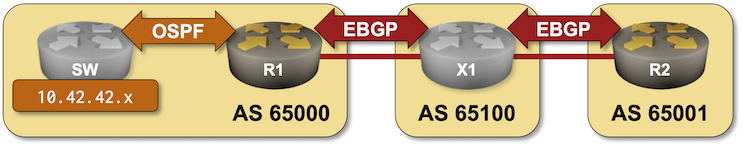

# BGP Route Aggregation

In the [Advertise IPv4 Prefixes to BGP Neighbors](3-originate.md) you configured a router to unconditionally advertise the IP prefix assigned to your site. That's good enough for small non-redundant networks; in more complex scenarios you'd want a WAN edge router to advertise a prefix only if it can reach at least some parts of that address space.

For example, in this lab exercise you'll configure the WAN edge router on Site-1 (R1) to advertise IP prefix 10.42.42.0/24 only if it has at least one more-specific prefix in the IP routing table.



You could achieve that goal in various ways; we'll use the easiest approach -- route *aggregation* (called *summarization* in other routing protocols). You'll configure BGP route aggregation on R1 and observe the results on R2.

## Lab Setup

If you're using *netlab, *you'll start with a preconfigured lab -- *netlab* will configure IP addressing, OSPF routing, and EBGP sessions. If you're using any other lab environment, you'll have to configure all of that manually. The following tables describe the OSPF and BGP setup; the _Reference Information_ section contains IP addressing information.

### BGP Routers and AS Numbers

| Node/ASN | Router ID | Advertised prefixes |
|----------|----------:|--------------------:|
| **AS65000** ||
| ce1 | 10.0.0.1 |  |
| **AS65001** ||
| ce2 | 10.0.0.2 |  |
| **AS65100** ||
| x1 | 10.0.0.10 |  |

### BGP Neighbors

| Node | Router ID /<br />Neighbor | Router AS/<br />Neighbor AS | Neighbor IPv4 |
|------|---------------------------|----------------------------:|--------------:|
| **ce1** | 10.0.0.1 | 65000 |
| | x1 | 65100 | 10.1.0.2 |
| **ce2** | 10.0.0.2 | 65001 |
| | x1 | 65100 | 10.1.0.10 |
| **x1** | 10.0.0.10 | 65100 |
| | ce1 | 65000 | 10.1.0.1 |
| | ce2 | 65001 | 10.1.0.9 |

### OSPF Setup (Area 0.0.0.0)

| Router | Interface | IPv4 Address | Neighbor(s) |
|--------|-----------|-------------:|-------------|
| ce1 | Loopback | 10.0.0.1/32 | |
|  | Ethernet2 | 10.1.0.5/30 | sw |
| sw | Loopback | 10.42.42.1/32 | |
|  | swp1 | 10.1.0.6/30 | ce1 |
|  | swp3 | 10.42.42.129/25 | passive |

## Start the Lab

Assuming you already [set up your lab infrastructure](../1-setup.md):

* Change directory to `basic/8-aggregate`
* Execute **netlab up** ([other options](../external/index.md))
* Log into your devices with **netlab connect** and verify IP addresses, OSPF routing, and basic BGP configuration.

!!! Note
    *netlab* will configure IP addressing, OSPF routing, and EBGP sessions on your routers. If you're not using *netlab*, you'll have to configure them manually.

## Redistribute OSPF into BGP

BGP will summarize (aggregate) only prefixes already in the BGP table. At the moment your BGP tables are empty (you have not configured any prefixes to advertise). Redistribute OSPF into BGP on R1 to populate the BGP table with the prefixes from the 10.42.42.0/24 address space like you did in the [Redistribute IGP Information Into BGP](5-redistribute.md) lab exercise.

!!! Note
    When you configure OSPF-to-BGP redistribution some network devices redistribute only routes received from other OSPF routers while other devices also redistribute local subnets on which you're running OSPF. This implementation difference will not impact our lab exercise but might result in slightly different printouts.

After configuring the OSPF-to-BGP redistribution on R1 (running Arista cEOS), the BGP table on R1 contains numerous prefixes learned via OSPF[^BN]:

[^BN]: I'm using `|begin Network` filter on the **show ip bgp** command to skip the printout legend.

```
ce1#show ip bgp|begin Network
          Network                Next Hop              Metric  AIGP       LocPref Weight  Path
 * >      10.0.0.3/32            10.1.0.6              -       -          -       0       i
 * >      10.42.42.16/28         10.1.0.6              -       -          -       0       i
 * >      10.42.42.128/25        10.1.0.6              -       -          -       0       i
```

R1 advertises all these prefixes to X1 which propagates them to R2. The BGP table on R2 (and the global Internet) thus contains internal prefixes from Site-1 (a bad idea, but we'll fix it).

```
ce2>show ip bgp|begin Network
          Network                Next Hop              Metric  AIGP       LocPref Weight  Path
 * >      10.0.0.3/32            10.1.0.10             0       -          100     0       65100 65000 i
 * >      10.42.42.16/28         10.1.0.10             0       -          100     0       65100 65000 i
 * >      10.42.42.128/25        10.1.0.10             0       -          100     0       65100 65000 i
```

## Configure BGP Route Aggregation

This step is the crux of this lab exercise: using a BGP configuration command similar to **aggregate-address** create a summary prefix 10.42.42.0/24 that will be advertised if at least one more specific prefix is in the BGP table.

The aggregate BGP prefix should appear in the BGP table on R1:

```
ce1#show ip bgp|begin Network
          Network                Next Hop              Metric  AIGP       LocPref Weight  Path
 * >      10.0.0.3/32            10.1.0.6              -       -          -       0       i
 * >      10.42.42.0/24          -                     0       -          -       0       i
 * >      10.42.42.16/28         10.1.0.6              -       -          -       0       i
 * >      10.42.42.128/25        10.1.0.6              -       -          -       0       i
```

The aggregated prefix is propagated to X1 and R2 (the good part), but R1 still advertises more-specific prefixes (the bad part) and a loopback prefix (the ugly part).

```
ce2>show ip bgp|begin Network
          Network                Next Hop              Metric  AIGP       LocPref Weight  Path
 * >      10.0.0.3/32            10.1.0.10             0       -          100     0       65100 65000 i
 * >      10.42.42.0/24          10.1.0.10             0       -          100     0       65100 65000 i
 * >      10.42.42.16/28         10.1.0.10             0       -          100     0       65100 65000 i
 * >      10.42.42.128/25        10.1.0.10             0       -          100     0       65100 65000 i
```

## Suppress More Specific Prefixes

Most BGP implementations can suppress more-specific prefixes within an aggregate prefix. This functionality is often configured with the **summary-only** option of the **aggregate-address** BGP configuration command.

To fix the *bad part* of your current implementation, suppress more-specific prefixes of the prefix 10.42.42.0/24 on R1.

After configuring the prefix suppression, examine the BGP table on R1. The more specific prefixes should be marked with `s` (suppressed):

```
ce1#show ip bgp|begin Network
          Network                Next Hop              Metric  AIGP       LocPref Weight  Path
 * >      10.0.0.3/32            10.1.0.6              -       -          -       0       i
 * >      10.42.42.0/24          -                     0       -          -       0       i
 *s>      10.42.42.16/28         10.1.0.6              -       -          -       0       i
 *s>      10.42.42.128/25        10.1.0.6              -       -          -       0       i
```

The suppressed prefixes should not be visible on R2 (unless you're dealing with a [nasty BGP bug](https://blog.apnic.net/2023/04/13/navigating-a-bgp-zombie-outbreak-on-juniper-routers/)):

```
ce2>show ip bgp|begin Network
          Network                Next Hop              Metric  AIGP       LocPref Weight  Path
 * >      10.0.0.3/32            10.1.0.10             0       -          100     0       65100 65000 i
 * >      10.42.42.0/24          10.1.0.10             0       -          100     0       65100 65000 i
```

## Filter Outbound Updates

Finally, let's fix the *ugly* part -- deploy an outbound filter on the R1-X1 EBGP session that accepts only the prefixes you want to advertise (`10.42.42.0/24`)[^ADD]. See the [Filter Advertised Prefixes](../policy/3-prefix.md) lab exercise for more details.

[^ADD]: You should be a good Internet citizen and always do that anyway -- you wouldn't want to make [headline news](https://blog.cloudflare.com/how-verizon-and-a-bgp-optimizer-knocked-large-parts-of-the-internet-offline-today/) when [your upstream providers fail to do their job](https://blog.ipspace.net/2019/07/rant-some-internet-service-providers.html).

With the outbound filter in place, the BGP table on R2 should contain only the desired IP prefix assigned to Site-1. Mission Accomplished!

```
ce2>show ip bgp|begin Network
          Network                Next Hop              Metric  AIGP       LocPref Weight  Path
 * >      10.42.42.0/24          10.1.0.10             0       -          100     0       65100 65000 i
```

## Final Verification

* Disable the R1-SW link.
* Verify that the OSPF routes advertised by SW disappear from the BGP table on R1
* Verify that R1 advertises no BGP prefixes to X1/R2.

## Reference Information

You might find the following information useful if you're not using _netlab_ to build the lab:

### Lab Wiring

This lab uses a the [4-router lab topology](../external/4-router.md).

| Origin Device | Origin Port | Destination Device | Destination Port |
|---------------|-------------|--------------------|------------------|
| ce1 | Ethernet1 | x1 | swp1 |
| ce1 | Ethernet2 | sw | swp1 |
| ce2 | Ethernet1 | x1 | swp3 |

### Lab Addressing

| Node/Interface | IPv4 Address | IPv6 Address | Description |
|----------------|-------------:|-------------:|-------------|
| **ce1** |  10.0.0.1/32 |  | Loopback |
| Ethernet1 | 10.1.0.1/30 |  | ce1 -> x1 |
| Ethernet2 | 10.1.0.5/30 |  | ce1 -> sw |
| **ce2** |  10.0.0.2/32 |  | Loopback |
| Ethernet1 | 10.1.0.9/30 |  | ce2 -> x1 |
| **sw** |  10.0.0.3/32 |  | Loopback |
| swp1 | 10.1.0.6/30 |  | sw -> ce1 |
| lo1 | 10.42.42.129/25 |  | Loopback |
| lo2 | 10.42.42.17/28 |  | Loopback |
| **x1** |  10.0.0.10/32 |  | Loopback |
| swp1 | 10.1.0.2/30 |  | x1 -> ce1 |
| swp3 | 10.1.0.10/30 |  | x1 -> ce2 |
