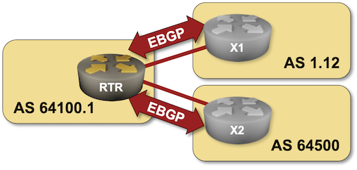

# Use 4-Octet BGP AS Numbers

The designers of the first version of BGP decided to use two bytes for BGP AS numbers -- after all, why would we ever have more than 65000 large networks in the whole world? That assumption was quickly invalidated once the Internet caught on, and end-users started using BGP for redundant connections to the global Internet. The fix: four-byte AS Numbers defined in [RFC 6793](https://datatracker.ietf.org/doc/html/rfc6793).

There's not much difference between the traditional BGP using two-byte AS numbers and the newer implementation; in most cases, you can start using AS numbers larger than 65535 and move on. You'll practice that in this lab exercise.



!!! warning
    This lab requires _netlab_ release 1.8.0 or greater. To upgrade to a pre-release version of _netlab_ 1.8.0, use `pip3 install --upgrade --pre networklab==1.8.0`.

## Start the Lab

Assuming you already [set up your lab infrastructure](../1-setup.md):

* Change directory to `basic/a-4octet-asn`
* Execute **netlab up** ([device requirements](#req), [other options](../external/index.md))
* Log into your device (RTR) with **netlab connect rtr** and verify that the IP addresses are configured on all its interfaces.

## Configuration Tasks

* Enable the BGP daemon if you're using Cumulus Linux or FRR ([more details](0-frrouting.md))
* Enable *asdot* AS path notation (if available)
* Start the BGP routing process with a private 4-octet AS number 64100.7 (4200857607)
* Configure EBGP sessions using the following parameters:

| neighbor IP address | neighbor AS number |
|--------------------:|-------------------:|
| 10.1.0.2            | 1.12 (65548)       |
| 10.1.0.6            | 64500              |

!!! tip
    Very large numbers are hard to work with (private four-octet AS numbers [start at](https://www.iana.org/assignments/iana-as-numbers-special-registry/iana-as-numbers-special-registry.xhtml) 4200000000). [RFC 5396](https://datatracker.ietf.org/doc/html/rfc5396) introduced _asdot_ notation to make them easier to use. Using the _asdot_ notation, a four-octet AS number is represented as two 2-octet numbers (similarly to how we write IPv4 addresses).

You should also:

* Add neighbor descriptions to simplify troubleshooting
* Enable BGP neighbor status logging to get an information message when the BGP session is established.

You should be familiar with both tasks as you already performed them in the [Configure a Single EBGP Session](1-session.md) and [Configure Multiple EBGP Sessions](2-multihomed.md) lab exercises.

Finally, you might have to:

* Create default inbound and outbound filters on devices that are [fully compliant with RFC 8212](https://blog.ipspace.net/2023/06/default-ebgp-policy-rfc-8212.html).

## Verification

Check the state of the BGP session with a command similar to **show ip bgp summary**. This is a printout taken from Arista EOS using *asplain* ASN notation:

```
rtr#show ip bgp summary
BGP summary information for VRF default
Router identifier 10.0.0.1, local AS number 4200857607
Neighbor Status Codes: m - Under maintenance
  Neighbor V AS           MsgRcvd   MsgSent  InQ OutQ  Up/Down State   PfxRcd PfxAcc
  10.1.0.2 4 65548             51        58    0    0 00:02:19 Estab   1      1
  10.1.0.6 4 64500             49        58    0    0 00:02:13 Estab   1      1
```

Here's the same printout using the *asdot* notation. Note the changes in the local AS number and one of the remote AS numbers:

```
rtr#show ip bgp summary
BGP summary information for VRF default
Router identifier 10.0.0.1, local AS number 64100.7
Neighbor Status Codes: m - Under maintenance
  Neighbor V AS           MsgRcvd   MsgSent  InQ OutQ  Up/Down State   PfxRcd PfxAcc
  10.1.0.2 4 1.12              38        43    0    0 00:01:41 Estab   1      1
  10.1.0.6 4 64500             36        43    0    0 00:01:35 Estab   1      1
```

Finally, use a command similar to **show ip bgp** to verify that your router received one prefix from each EBGP neighbor. Yet again, when using the *asdot* ASN notation, you'll notice dotted  AS numbers in the AS paths.

```
rtr#show ip bgp | begin Network
          Network                Next Hop              Metric  AIGP       LocPref Weight  Path
 * >      192.168.100.0/24       10.1.0.2              0       -          100     0       1.12 i
 * >      192.168.101.0/24       10.1.0.6              0       -          100     0       64500 i
```

<!--
**Next:**

* [Connect with the second upstream provider](2-multihomed.md) and advertise your address space.
-->

## Reference Information

This lab uses a subset of the [4-router lab topology](../external/4-router.md). The following information might help you if you plan to build custom lab infrastructure:

### Device Requirements {#req}

* Customer router: use any device [supported by the _netlab_](https://netlab.tools/platforms/).
* External routers: use any device [supported by the _netlab_ BGP configuration module](https://netlab.tools/platforms/#platform-routing-support).
* You can do automated lab validation if you use Arista EOS, Cumulus Linux, or FRR on external routers.
* Git repository contains external router initial device configurations for Cumulus Linux.

### Lab Wiring

| Origin Device | Origin Port | Destination Device | Destination Port |
|---------------|-------------|--------------------|------------------|
| rtr | Ethernet1 | x1 | swp1 |
| rtr | Ethernet2 | x2 | swp1 |

### Lab Addressing

| Node/Interface | IPv4 Address | IPv6 Address | Description |
|----------------|-------------:|-------------:|-------------|
| **rtr** |  10.0.0.1/32 |  | Loopback |
| Ethernet1 | 10.1.0.1/30 |  | rtr -> x1 |
| Ethernet2 | 10.1.0.5/30 |  | rtr -> x2 |
| **x1** |  192.168.100.1/24 |  | Loopback |
| swp1 | 10.1.0.2/30 |  | x1 -> rtr |
| **x2** |  192.168.101.1/24 |  | Loopback |
| swp1 | 10.1.0.6/30 |  | x2 -> rtr |
