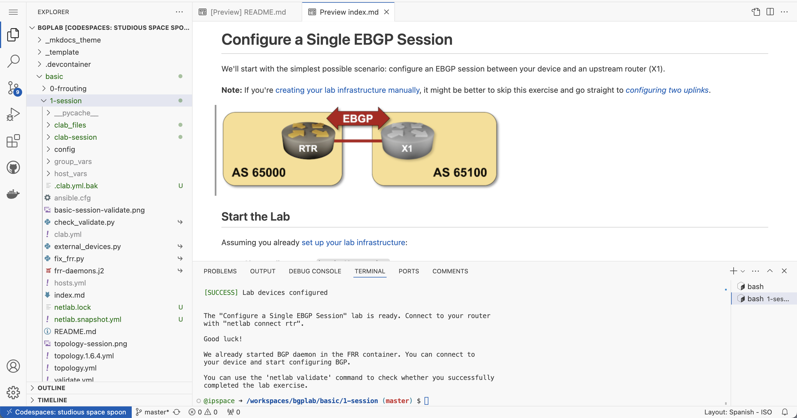

# Use GitHub Codespaces

You can run BGP labs in (free[^UTAP]) [GitHub codespaces](https://docs.github.com/en/codespaces/overview); all you need is a GitHub account:

* [Create a new codespace for your BGP labs](https://github.com/codespaces/new/bgplab/bgplab){:target="_blank"} or [connect to an existing codespace](https://github.com/codespaces){:target="_blank"}.
* Unless you're using GitHub codespaces with VScode (in which case you know what to do), your codespace opens in a new browser window with three tabs: Explorer (repository folders), Preview (starting with README), and Terminal.

[^UTAP]: You get 120 free core hours per month or [pay for more](https://docs.github.com/en/billing/managing-billing-for-github-codespaces/about-billing-for-github-codespaces).

## Select Lab Devices

The BGP labs repository uses a recent FRRouting container as the default device. To change the device settings, edit the `defaults.yml` file with `vi` or `nano`:
    
* It's best to use network devices with free-to-download container images:

| Device | Device type to use in `defaults.yml` |
|--------|--------------------------------------|
| Cumulus Linux 4.4 | cumulus |
| FRRouting | frr |
| Nokia SR Linux | srlinux |
| VyOS | vyos |

!!! tip
    Start with the [Configuring Cumulus Linux and FRRouting](basic/0-frrouting.md) exercise if you want to use the default settings but never worked with FRRouting before.

* Use FRRouting to use the 2 CPU/8 GB codespaces VM with more extensive labs.
* Codespaces have persistent storage; you can download and install other containers.
* To use containers that have to be downloaded from the vendors' website, download them onto your laptop, [drag-and-drop them into the Folders](https://blog.ipspace.net/2024/07/arista-eos-codespaces/), and install them [like you would on a local netlab instance](https://netlab.tools/labs/clab/#container-images).
* While it looks like the Codespaces environment supports nested virtualization, the environment does not include the `kvm` kernel module, so we cannot get virtual machines to work (yet). That also precludes running VMs in virtual machines (the *vrnetlab* approach).

## Start a Lab

Once you have the codespaces up and running:

* Click on the desired lab exercise in the README.md preview window to select the exercise folder.
* Right-click on the exercise folder and select "*Open in Integrated Terminal*" to launch a **bash** session in the desired directory.
* Execute **netlab up** to start the lab.
* Expand the exercise folder in the Explorer tab.
* Right-click on the `README.md` file and select "_Open Preview_" to open the rendered version of the file.
* Click the link in the README.md file to get the exercise description in the preview pane.
* Connect to your devices with the **netlab connect** command executed in the Terminal pane.

## Cleanup and Shutdown

Finally, don't forget to shut down the lab with **netlab down** and stop your codespace after you're done:

* Click on the blue "*Codespaces*" button in the bottom-left corner of the browser window.
* Select "*Stop Current Codespace*". You should also adjust *idle timeout* and *default retention period* in [your codespaces settings](https://github.com/settings/codespaces).