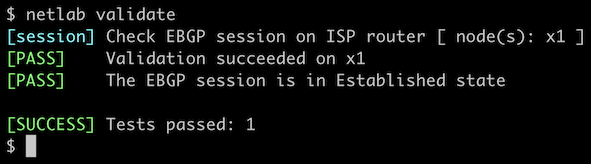

# Configure a Single EBGP Session

We'll start with the simplest possible scenario: configure an EBGP session between your device and an upstream router (X1).

**Note:** If you're [creating your lab infrastructure manually](../external/index.md), it might be better to skip this exercise and go straight to *[configuring two uplinks](2-multihomed.md)*.


## Start the Lab

Assuming you already [set up your lab infrastructure](../1-setup.md):

* Change directory to `basic/1-session`
* Execute **netlab up** ([device requirements](#req), [other options](../external/index.md))
* Log into your device (RTR) with **netlab connect rtr** and verify that the IP addresses are configured on all its interfaces.

## Configuration Tasks

* Start BGP routing process with AS number 65000
* Configure an EBGP session using the following parameters:

| neighbor IP address | neighbor AS number |
|--------------------:|-------------------:|
| 10.1.0.2            | 65100              |

!!! Tip
    If you're using Cumulus Linux or FRR on RTR, you might have to enable the BGP daemon first. You'll find more details in the [Configuring Cumulus Linux and FRRouting](0-frrouting.md) lab.

!!! Warning
    If your device happens to be [fully compliant with RFC 8212](https://blog.ipspace.net/2023/06/default-ebgp-policy-rfc-8212.html) (example: Cisco IOS XR), you'll have to configure a *permit everything* incoming filter on the EBGP session or your device won't accept updates from its EBGP neighbor(s).

On some devices, you'll also have to **activate** the EBGP session within the IPv4 **address family** to tell the BGP daemon on your router to accept IPv4 prefixes from its neighbor.

Finally, it's always a good idea to configure:

* Neighbor description to simplify troubleshooting and
* BGP neighbor status logging to get an information message when the BGP session is established.

## Verification

You can use the **netlab validate** command if you've installed *netlab* release 1.8.3 or later and use Cumulus Linux, FRR, or Arista EOS on the external routers.



If that command fails or you're using another network operating system on the external routers, it's time to start a troubleshooting session.

Check the state of the BGP session with a command similar to **show ip bgp summary**. This is a printout taken from Arista EOS:

```
rtr#show ip bgp summary
BGP summary information for VRF default
Router identifier 10.0.0.1, local AS number 65000
Neighbor Status Codes: m - Under maintenance
  Neighbor V AS           MsgRcvd   MsgSent  InQ OutQ  Up/Down State   PfxRcd PfxAcc
  10.1.0.2 4 65100             33        37    0    0 00:01:25 Estab   2      2
```

Finally, use a command similar to **show ip bgp** to verify that your router received two prefixes from the EBGP neighbor: the default route and the loopback remote interface (10.0.0.10/32). This is what the printout looks like on Arista EOS:

```
rtr#show ip bgp
BGP routing table information for VRF default
Router identifier 10.0.0.1, local AS number 65000
Route status codes: s - suppressed contributor, * - valid, > - active, E - ECMP head, e - ECMP
                    S - Stale, c - Contributing to ECMP, b - backup, L - labeled-unicast
                    % - Pending BGP convergence
Origin codes: i - IGP, e - EGP, ? - incomplete
RPKI Origin Validation codes: V - valid, I - invalid, U - unknown
AS Path Attributes: Or-ID - Originator ID, C-LST - Cluster List, LL Nexthop - Link Local Nexthop

          Network                Next Hop              Metric  AIGP       LocPref Weight  Path
 * >      0.0.0.0/0              10.1.0.2              0       -          100     0       65100 i
 * >      10.0.0.10/32           10.1.0.2              0       -          100     0       65100 i
```

**Next:**

* [Connect with the second upstream provider](2-multihomed.md) and advertise your address space.

## Reference Information

This lab uses a subset of the [4-router lab topology](../external/4-router.md). The following information might help you if you plan to build custom lab infrastructure:

### Device Requirements {#req}

* Customer router: use any device [supported by the _netlab_ BGP configuration module](https://netlab.tools/platforms/#platform-routing-support).
* External router needs support for [default route origination](https://netlab.tools/plugins/bgp.session/#platform-support). If you want to use an unsupported device as an external router, remove the **bgp.originate** attribute from the lab topology.
* You can do automated lab validation with Arista EOS, Cumulus Linux, or FRR running on the external router. Automated lab validation requires _netlab_ release 1.8.3 or higher.
* Git repository contains external router initial device configurations for Cumulus Linux.

### Lab Wiring

| Origin Device | Origin Port | Destination Device | Destination Port |
|---------------|-------------|--------------------|------------------|
| rtr | Ethernet1 | x1 | swp1 |

### Lab Addressing

| Node/Interface | IPv4 Address | IPv6 Address | Description |
|----------------|-------------:|-------------:|-------------|
| **rtr** |  10.0.0.1/32 |  | Loopback |
| Ethernet1 | 10.1.0.1/30 |  | rtr -> x1 |
| **x1** |  10.0.0.10/32 |  | Loopback |
| swp1 | 10.1.0.2/30 |  | x1 -> rtr |
