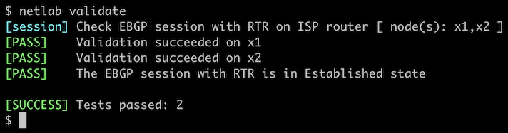

# Configure Multiple EBGP Sessions

Now that you know how to [configure an EBGP session](1-session.md), let's move on to a more realistic scenario: you have a site with a WAN edge router connected to two upstream ISPs, and you're running EBGP with them.


The routers in your lab use the following BGP AS numbers. Each upstream router advertises an IPv4 prefix and the default route.

| Node/ASN | Router ID | Advertised prefixes |
|----------|----------:|--------------------:|
| **AS65100** ||
| x1 | 10.0.0.10 | 192.168.100.0/24 |
| **AS65101** ||
| x2 | 10.0.0.11 | 192.168.101.0/24 |

## Start the Lab

Assuming you already [set up your lab infrastructure](../1-setup.md):

* Change directory to `basic/2-multihomed`
* Execute **netlab up** ([device requirements](#req), [other options](../external/index.md))
* Log into your device (RTR) with **netlab connect rtr** and verify that the IP addresses are configured on all its interfaces.

## Configuration Tasks

* Start BGP routing process with AS number 65000
* Configure EBGP sessions using the following parameters:

| Node | Neighbor | Neighbor IPv4 | Neighbor AS |
|------|----------|--------------:|------------:|
| rtr | x1 | 10.1.0.2 | 65100 |
| rtr | x2 | 10.1.0.6 | 65101 |

!!! Tip
    If you're using Cumulus Linux or FRR on RTR, you might have to enable the BGP daemon first. You'll find more details in the [Configuring Cumulus Linux and FRRouting](0-frrouting.md) lab.

!!! Warning
    If your device happens to be [fully compliant with RFC 8212](https://blog.ipspace.net/2023/06/default-ebgp-policy-rfc-8212.html) (example: Cisco IOS XR), you'll have to configure a *permit everything* incoming filter on all EBGP neighbors or your device won't accept anything they send you.

You can also configure neighbor description and BGP neighbor status logging to get an information message when the BGP session is established.

## Verification

You can use the **netlab validate** command if you've installed *netlab* release 1.8.3 or later and use Cumulus Linux, FRR, or Arista EOS on the external routers.



If that command fails or you're using another network operating system on the external routers, it's time to start a troubleshooting session.

Check the state of the BGP session with a command similar to **show ip bgp summary**. This is a printout taken from Arista EOS:

```
rtr#show ip bgp summary
BGP summary information for VRF default
Router identifier 10.0.0.1, local AS number 65000
Neighbor Status Codes: m - Under maintenance
  Neighbor V AS           MsgRcvd   MsgSent  InQ OutQ  Up/Down State   PfxRcd PfxAcc
  10.1.0.2 4 65100              9         8    0    0 00:00:10 Estab   2      2
  10.1.0.6 4 65101              7         6    0    0 00:00:06 Estab   2      2
```

Finally, use a command similar to **show ip bgp** to verify that your router received three prefixes from each EBGP neighbor: the  IPv4 prefix configured on the remote loopback interface, another IPv4 prefix, and the default route. This is what the printout looks like on Arista EOS:

```
rtr#show ip bgp
BGP routing table information for VRF default
Router identifier 10.0.0.1, local AS number 65000
Route status codes: s - suppressed contributor, * - valid, > - active, E - ECMP head, e - ECMP
                    S - Stale, c - Contributing to ECMP, b - backup, L - labeled-unicast
                    % - Pending BGP convergence
Origin codes: i - IGP, e - EGP, ? - incomplete
RPKI Origin Validation codes: V - valid, I - invalid, U - unknown
AS Path Attributes: Or-ID - Originator ID, C-LST - Cluster List, LL Nexthop - Link Local Nexthop

          Network                Next Hop              Metric  AIGP       LocPref Weight  Path
 * >      0.0.0.0/0              10.1.0.2              0       -          100     0       65100 i
 *        0.0.0.0/0              10.1.0.6              0       -          100     0       65101 i
 * >      192.168.100.0/24       10.1.0.2              0       -          100     0       65100 i
 * >      192.168.101.0/24       10.1.0.6              0       -          100     0       65101 i
```

**Next:**

* [Advertise your IPv4 address space](3-originate.md) to the EBGP neighbors
* [Use multiple BGP AS numbers on the same router](../session/3-localas.md) (advanced exercise)

## Reference Information

This lab uses a subset of the [4-router lab topology](../external/4-router.md). The following information might help you if you plan to build custom lab infrastructure:

### Device Requirements {#req}

* Customer router: use any device [supported by the _netlab_ BGP configuration module](https://netlab.tools/platforms/#platform-routing-support).
* External routers need support for [default route origination](https://netlab.tools/plugins/bgp.session/#platform-support). If you want to use an unsupported device as an external router, remove the **bgp.originate** attribute from the lab topology.
* You can do automated lab validation when running Arista EOS, Cumulus Linux, or FRR on the external router. Automated lab validation requires _netlab_ release 1.8.3 or higher.
* Git repository contains external router initial device configurations for Cumulus Linux.

### Lab Wiring

| Origin Device | Origin Port | Destination Device | Destination Port |
|---------------|-------------|--------------------|------------------|
| rtr | Ethernet1 | x1 | swp1 |
| rtr | Ethernet2 | x2 | swp1 |

### Lab Addressing

| Node/Interface | IPv4 Address | IPv6 Address | Description |
|----------------|-------------:|-------------:|-------------|
| **rtr** |  10.0.0.1/32 |  | Loopback |
| Ethernet1 | 10.1.0.1/30 |  | rtr -> x1 |
| Ethernet2 | 10.1.0.5/30 |  | rtr -> x2 |
| **x1** |  192.168.100.1/24 |  | Loopback |
| eth1 | 10.1.0.2/30 |  | x1 -> rtr |
| **x2** |  192.168.101.1/24 |  | Loopback |
| eth1 | 10.1.0.6/30 |  | x2 -> rtr |
