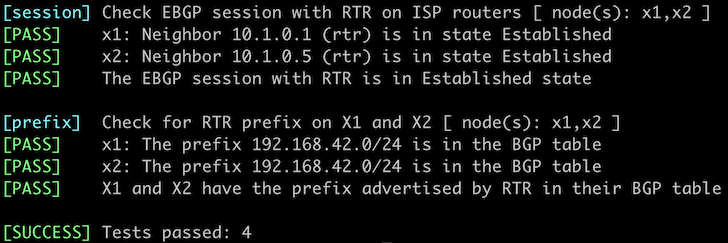

# Protect BGP Sessions with Passwords and GTSM

Now that you know how to [configure EBGP sessions](2-multihomed.md) let's see how you can make it harder for someone to mess them up. Two mechanisms are commonly used to protect EBGP sessions (or the control plane/CPU of the router running them):

* Generalized TTL Security Mechanism (GTSM) described in [RFC 5082](https://www.rfc-editor.org/rfc/rfc5082) ([more details](https://blog.ipspace.net/2023/03/advantages-bgp-gtsm.html))
* Cryptographic protection (but not encryption) of underlying TCP sessions with MD5 checksums or TCP Authentication Option described in [RFC 5925](https://datatracker.ietf.org/doc/html/rfc5925).

In this lab, you'll use:

* GTSM on the EBGP session with ISP-1
* MD5 checksum on the EBGP session with ISP-2[^NOL]

If you want to practice BGP session protection with TCP-AO, check out the [TCP-AO lab](9-ao.md)[^NOL].

[^NOL]: I would love to add a TCP-AO-protected session to this lab, but you cannot use TCP-AO on Cumulus Linux or FRR because it's not yet (as of September 2023) implemented in the Linux kernel. That's the price you're paying for riding on top of other people's infrastructure.


The routers in your lab use the following BGP AS numbers. Each upstream router advertises an IPv4 prefix and the default route.

| Node/ASN | Router ID | Advertised prefixes |
|----------|----------:|--------------------:|
| **AS65000** ||
| rtr | 10.0.0.1 | 192.168.42.0/24 |
| **AS65100** ||
| x1 | 10.0.0.10 | 192.168.100.0/24 |
| **AS65101** ||
| x2 | 10.0.0.11 | 192.168.101.0/24 |

## Start the Lab

Assuming you already [set up your lab infrastructure](../1-setup.md):

* Change directory to `basic/6-protect`
* Execute **netlab up** ([device requirements](#req), [other options](../external/index.md))
* Log into your device (RTR) with **netlab connect rtr** and verify that the IP addresses are configured on all its interfaces.

If you're using *netlab*, you'll get a fully configured lab, including BGP prefix origination on RTR and EBGP sessions between RTR and X1/X2. If you're using some other lab platform, it's best if you do this lab exercise after the [Advertise IPv4 Prefixes to BGP Neighbors](3-originate.md) one.

## Configuration Tasks

The EBGP sessions with X1 and X2 will not be established because X1 and X2 use EBGP session protection. They might be stuck in `Connect`, `OpenSent` or `OpenConfirm` state as illustrated by the following printout produced on Arista cEOS:

```
rtr>show ip bgp summary
BGP summary information for VRF default
Router identifier 10.0.0.1, local AS number 65000
Neighbor Status Codes: m - Under maintenance
  Description              Neighbor V AS           MsgRcvd   MsgSent  InQ OutQ  Up/Down State   PfxRcd PfxAcc
  x1                       10.1.0.2 4 65100             11        13    0   76 00:00:14 OpenConfirm
  x2                       10.1.0.6 4 65101             10         8    0    0 00:00:12 Connect
```

To make the lab work:

* Configure TTL protection (GTSM) on the EBGP session with X1
* Configure MD5 TCP checksum on the EBGP session with X2. The password used by X2 is `GuessWhat`.

## Verification

You can use the **netlab validate** command if you've installed *netlab* release 1.8.3 or later and use Cumulus Linux, FRR, or Arista EOS on X1 and X2.



Do manual verification if the **netlab validate** command fails or you're using another network operating system on those routers.

Check the state of the BGP sessions with a command similar to **show ip bgp summary**. This is a printout taken from Arista EOS:

```
rtr#show ip bgp summary
BGP summary information for VRF default
Router identifier 10.0.0.1, local AS number 65000
Neighbor Status Codes: m - Under maintenance
  Description              Neighbor V AS           MsgRcvd   MsgSent  InQ OutQ  Up/Down State   PfxRcd PfxAcc
  x1                       10.1.0.2 4 65100             42        63    0    0 00:00:16 Estab   2      2
  x2                       10.1.0.6 4 65101             17        16    0    0 00:00:04 Estab   2      2
```

Finally, use a command similar to **show ip bgp** to display the prefixes your router received from its EBGP neighbors.

## Reference Information

This lab uses a subset of the [4-router lab topology](../external/4-router.md). The following information might help you if you plan to build custom lab infrastructure:

### Device Requirements {#req}

* Customer router: use any device [supported by the _netlab_ BGP configuration module](https://netlab.tools/platforms/#platform-routing-support).
* _netlab_ has to configure default route origination, MD5 password, and GTSM on the external routers. You'll find the supported devices in the **bgp.session** [platform support table](https://netlab.tools/plugins/bgp.session/#platform-support).
* You can do automated lab validation with Arista EOS, Cumulus Linux, or FRR running on the X1, and X2. Automated lab validation requires _netlab_ release 1.8.3 or higher.
* Git repository contains external router initial device configurations for Cumulus Linux.

### Lab Wiring

This lab uses a subset of the [4-router lab topology](../external/4-router.md):

| Origin Device | Origin Port | Destination Device | Destination Port |
|---------------|-------------|--------------------|------------------|
| rtr | Ethernet1 | x1 | swp1 |
| rtr | Ethernet2 | x2 | swp1 |

### Lab Addressing

| Node/Interface | IPv4 Address | IPv6 Address | Description |
|----------------|-------------:|-------------:|-------------|
| **rtr** |  10.0.0.1/32 |  | Loopback |
| Ethernet1 | 10.1.0.1/30 |  | rtr -> x1 |
| Ethernet2 | 10.1.0.5/30 |  | rtr -> x2 |
| **x1** |  192.168.100.1/24 |  | Loopback |
| swp1 | 10.1.0.2/30 |  | x1 -> rtr |
| **x2** |  192.168.101.1/24 |  | Loopback |
| swp1 | 10.1.0.6/30 |  | x2 -> rtr |

