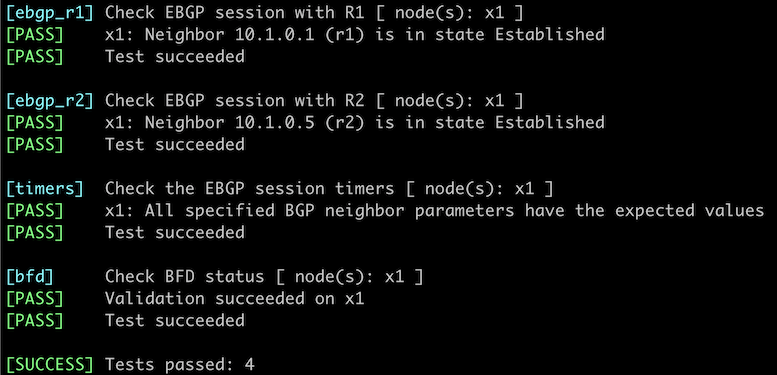

# Use BGP Timers and BFD to Speed Up BGP Convergence

Out-of-the-box EBGP is notoriously slow to converge -- it can take up to three minutes to detect a failed EBGP neighbor. It's possible to tweak BGP timers to detect a failed neighbor in a few seconds. Still, it's [much better](https://blog.ipspace.net/2017/10/to-bfd-or-not-to-bfd.html) to combine BGP with Bidirectional Forwarding Detection (BFD) -- a lightweight protocol that can [detect a link- or node failure in milliseconds](https://blog.ipspace.net/2020/11/detecting-network-failure.html).

In this lab, you'll use both mechanisms:

* You'll tweak the BGP timers to detect a link failure within 10 seconds.
* You'll enable BFD on an EBGP neighbor to reduce the failure detection time to approximately a second.


The routers in your lab use the following BGP AS numbers. Your routers advertise an IPv4 prefix each; X1 does not advertise BGP prefixes.

| Node/ASN | Router ID | Advertised prefixes |
|----------|----------:|--------------------:|
| **AS65000** ||
| r1 | 10.0.0.1 | 192.168.42.0/24 |
| **AS65001** ||
| r2 | 10.0.0.2 | 192.168.43.0/24 |
| **AS65100** ||
| x1 | 10.0.0.10 |  |

## Start the Lab

Assuming you already [set up your lab infrastructure](../1-setup.md):

* Change directory to `basic/7-bfd`
* Execute **netlab up** ([device requirements](#req), [other options](../external/index.md))
* Log into your devices (R1,R2) with **netlab connect _node_** and verify their configuration.

If you're using *netlab*, you'll get a fully configured lab, including BGP prefix origination on R1 and R2 and EBGP sessions between R1/R2 and X1. If you're using another lab platform, you'll have to do a fair amount of prep work[^PW].

[^PW]: I did [tell you to use _netlab_](../1-setup.md), didn't I?

## Checking the Convergence Time

* Log into R2 and enable debugging/logging of BGP updates (example: Cisco IOS) or monitoring of the IP routing table (example: Arista EOS **event monitor**). If your platform does not have similar functionality, you'll have to inspect the BGP table on R2 every few seconds.
* Log into R1 and remove the IP address from the R1-X1 link.

!!! Note
    It would be easier to shut down the R1-X1 link, but that trick doesn't work with devices like Arista EOS that tear down the BGP session before shutting down the link.
    
I used Arista EOS **event monitor** on R2, added an IP address on the R1 Ethernet1 interface, and removed it as soon as the BGP session was established. It took BGP almost exactly three minutes to detect the failed EBGP session between X1 and R1:

```
r2#sh event-monitor route match-ip 192.168.42.0/24
2023-09-16 16:02:25.953617|192.168.42.0/24|default|ebgp|0|200|updated|24
2023-09-16 16:05:27.071501|192.168.42.0/24|default|ebgp|0|0|removed|25
```

## Reduce the BGP Timers

You can reduce BGP session timers to improve BGP convergence:

* On the R1-X1 EBGP session, set the keepalive timer to three seconds and the hold timer (timeout) to nine seconds.
* Clear the EBGP session if needed[^ATD] -- the BGP timers are negotiated during the BGP session establishment phase.

[^ATD]: Some BGP implementations tear down BGP sessions when you change the BGP timers.

!!! tip
    FRRouting and Cumulus Linux using the *datacenter* profile already use low BGP timers. The lab configuration process returns those timers to the default 60/180 seconds.

**Verification:**

* Verify that you reduced the BGP timers with a command similar to **show ip bgp neighbor detail**. 
* Repeat the BGP convergence measurements -- X1 should revoke the BGP prefix advertised by R1 within nine seconds.

## Configure BFD

While some BGP implementations allow you to use very small BGP timers (for example, a one-second keepalive timer), you should use something other than that approach if you care about BGP convergence speed. It's much better to combine BGP with BFD:

* Configure BFD on the EBGP neighbor session on R1
* Clear the BGP session if needed

!!! warning
    Similarly to what you had to do to get BGP up and running, you have to modify the `/etc/frr/daemons` file and restart FRR on Culumus Linux and FRRouting virtual machines ([more details](0-frrouting.md)). The BFD daemon is already started in FRRouting containers.
     
**Verification:**

* Verify that you have a working BFD session between R1 and X1. Most implementations display the BFD status of a BGP neighbor somewhere within the **show ip bgp neighbor details** (or similar) command. Some implementations have BFD-specific show commands like **show bfd neighbors** or **show bfd peers**.
* Repeat the BGP convergence measurements -- X1 should revoke the BGP prefix advertised by R1 almost immediately.

## Automated Verification

You can use the **netlab validate** command if you've installed *netlab* release 1.8.3 or later and use Cumulus Linux or FRR on X1. The validation tests check the BGP timers on the R1-X1 EBGP session and the state of the R1-X1 BFD session. 

This is the printout you should get after completing the lab exercise:



## Reference Information

This lab uses a subset of the [4-router lab topology](../external/4-router.md). The following information might help you if you plan to build custom lab infrastructure:

### Device Requirements {#req}

* Customer router: use any device [supported by the _netlab_ BGP configuration module](https://netlab.tools/platforms/#platform-routing-support).
* _netlab_ has to configure BFD and BGP timers on the external routers. The device you want to use as an external router has to be supported by the [BFD configuration module](https://netlab.tools/platforms/#platform-routing-support) and the [**bgp.session** plugin](https://netlab.tools/plugins/bgp.session/#platform-support).
* You can do automated lab validation with Cumulus Linux or FRR running on X1. Automated lab validation requires _netlab_ release 1.8.3 or higher.
* Git repository contains external router initial device configurations for Cumulus Linux.

### Lab Wiring

| Origin Device | Origin Port | Destination Device | Destination Port |
|---------------|-------------|--------------------|------------------|
| r1 | Ethernet1 | x1 | swp1 |
| r2 | Ethernet1 | x1 | swp3 |

### Lab Addressing

| Node/Interface | IPv4 Address | IPv6 Address | Description |
|----------------|-------------:|-------------:|-------------|
| **r1** |  10.0.0.1/32 |  | Loopback |
| Ethernet1 | 10.1.0.1/30 |  | r1 -> x1 |
| **r2** |  10.0.0.2/32 |  | Loopback |
| Ethernet1 | 10.1.0.5/30 |  | r2 -> x1 |
| **x1** |  10.0.0.10/32 |  | Loopback |
| swp1 | 10.1.0.2/30 |  | x1 -> r1 |
| swp3 | 10.1.0.6/30 |  | x1 -> r2 |
