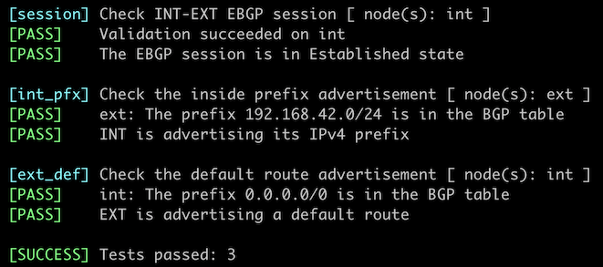

# Running EBGP Across a Firewall

Sometimes, you have to exchange BGP prefixes across a path containing intermediate devices not running BGP[^NCAD]. The intermediate devices could (for example) be high-speed switches with limited software support[^LIC], devices with small routing tables, or firewalls using static routing for security reasons.

[^NCAD]: They might not be capable of running BGP, or someone made an administrative/design decision not to run BGP on them.

[^LIC]: Or a crazy licensing scheme

In this lab exercise, you'll establish an EBGP session across a firewall between an internal (campus core) router and a WAN edge router and advertise the campus prefix to the WAN edge router.


## Existing Device Configuration

The devices in your lab have the following IPv4 addresses:

| Node/Interface | IPv4 Address | IPv6 Address | Description |
|----------------|-------------:|-------------:|-------------|
| **ext** |
| Ethernet1 | 172.16.0.3/24 |  | ext -> fw |
| **fw** |
| eth1 | 172.16.0.1/24 |  | fw -> ext |
| eth2 | 192.168.42.1/24 |  | fw -> int |
| **int** |
| Ethernet1 | 192.168.42.2/24 |  | int -> fw |

The routers use these BGP AS numbers. INT is advertising its LAN IPv4 prefix.

| Node/ASN | Router ID | Advertised prefixes |
|----------|----------:|--------------------:|
| **AS64501** ||
| ext | 10.0.0.3 | |
| **AS65000** ||
| int | 10.0.0.2 | 192.168.42.0/24 |

The firewall has static routes for all _netlab_ address pools pointing to the EXT router[^NDR]. You can inspect them with the `netlab connect fw ip route` command:

[^NDR]: _netlab_ configures several static routes instead of a default route. The default route usually points to the management network ([more details](https://netlab.tools/labs/linux/#host-routing)).

```bash
$ netlab connect -q fw ip route
default via 192.168.121.1 dev eth0
10.0.0.0/24 via 172.16.0.3 dev eth1
10.1.0.0/16 via 172.16.0.3 dev eth1
10.2.0.0/24 via 172.16.0.3 dev eth1
172.16.0.0/24 dev eth1 scope link  src 172.16.0.1
172.16.0.0/16 via 172.16.0.3 dev eth1
192.168.42.0/24 dev eth2 scope link  src 192.168.42.1
192.168.121.0/24 dev eth0 scope link  src 192.168.121.101
```

_netlab_ automatically configures interface IP addresses, static routes on the firewall, and BGP routing processes; you'll have to configure them manually if you're using some other lab infrastructure.


## Start the Lab

Assuming you already [set up your lab infrastructure](../1-setup.md):

* Use any device [supported by the _netlab_ BGP configuration module](https://netlab.tools/platforms/#platform-routing-support) for your routers.
* Change directory to `basic/e-ebgp-multihop`
* Execute **netlab up**
* Log into your devices with **netlab connect** and verify that the IP addresses and the EBGP sessions are properly configured.

!!! tip
    The lab topology uses a Linux host instead of a firewall. If you want to use a real firewall instead, use the **-s** option of the **netlab up** command to set the device type for the **fw** node. For example, to use ASAv, start the lab with `netlab up -s nodes.fw.device=asav`. Please note that *netlab* won't configure static routing on devices other than a Linux host.

### Configuration Tasks

You must establish an EBGP session between the Ethernet interfaces of INT and EXT routers.

These routers do not know how to reach each other, so you have to create static routes to help them get started:

* On INT, create a static route for 172.16.0.3/32 pointing to 192.168.42.1. Most network devices use a configuration command similar to **ip route _prefix_ _nexthop_**.
* On EXT, create a static route for 192.168.42.2/32 pointing to 172.16.0.1

!!! tip
    It's best to use host routes for the remote endpoints of multihop EBGP sessions, allowing remote routers to advertise their directly connected prefixes dynamically.

With the static routes in place:

* On INT, add 172.16.0.3 as a BGP neighbor in AS 64501
* On EXT, add 172.16.42.2 as a BGP neighbor in AS 65000
* Advertise the default route from EXT to INT.

!!! tip
    For more details, review the [Configure a Single EBGP Session](1-session.md) and [Advertise Default Route in BGP](c-default-route.md) lab exercises.

Most BGP implementations will refuse to establish the EBGP session you just configured, as they expect EBGP neighbors to be *directly connected*. Use a command similar to **neighbor ebgp-multihop** to tell your devices that the EBGP neighbor is further away. That command:

* Disables the *directly connected neighbor* check
* Increases the TTL of the EBGP IP packets to ensure they reach the distant neighbor (some devices allow you to specify how far away the neighbor is).

!!! tip
    Please note that you can't use fake (overly large) IP subnets on INT and EXT to make them believe the neighbor is directly connected. The EBGP session would still not be established because the firewall decreases the TTL of forwarded IP packets, and most BGP implementations send EBGP IP packets with TTL=1.

## Verification

You can use the **netlab validate** command if you've installed *netlab* release 1.8.3 or later and use Cumulus Linux, FRR, or Arista EOS on your routers. The validation tests check:

* The state of the EBGP session between INT and EXT
* Whether EXT receives the prefix 192.168.42.0/24 from INT
* Whether INT receives the default route from EXT

This is the result you should get after completing the lab exercise:



You can also do manual verification:

* Check the state of the EBGP session on INT with a command similar to **show ip bgp summary**. The session with EXT should be in the established state:

```
int>show ip bgp summary
BGP summary information for VRF default
Router identifier 10.0.0.2, local AS number 65000
Neighbor Status Codes: m - Under maintenance
  Neighbor   V AS           MsgRcvd   MsgSent  InQ OutQ  Up/Down State   PfxRcd PfxAcc
  172.16.0.3 4 64501             33        33    0    0 00:20:44 Estab   1      1
```

* Check the BGP table on INT with a command similar to **show ip bgp**. You should see the local prefix and the default route[^BN]:

```
int>show ip bgp | begin Network
          Network                Next Hop              Metric  AIGP       LocPref Weight  Path
 * >      0.0.0.0/0              172.16.0.3            0       -          100     0       64501 ?
 * >      192.168.42.0/24        -                     -       -          -       0       i
```

[^BN]: The `| begin Network` filter removes the legend from the **show ip bgp** command on Arista EOS.

* Check the BGP table on EXT. You should see the 192.168.42.0/24 prefix advertised by INT:

```
ext>show ip bgp | begin Network
          Network                Next Hop              Metric  AIGP       LocPref Weight  Path
 * >      192.168.42.0/24        192.168.42.2          0       -          100     0       65000 i
```

