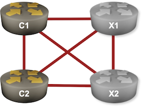

# Small (4-Router) Lab Topology

The exercises that have one or two configurable devices use the following 4-router lab topology:

* C1 and C2 are the lab devices you'll configure in the hands-on labs. C1 is usually named *rtr*; when a lab uses both routers they're usually named *r1* and *r2*.
* X1 and X2 are external BGP routers.

The individual labs assume you're using Cumulus Linux 4.x as external BGP routers (FRR running on a Ubuntu VM/container would work as well) and provide initial interface- and FRR configurations for them as well as extra configuration needed in your lab.

You can use any device you want for the external BGP routers, but you'll have to create your own initial configuration files (if you're not using _netlab_) and _extra device configuration_ templates. Should you decide to go down this route, we'd appreciate if you'd submit your changes as a pull request.

## Lab Wiring

Creating a full mesh of links between four devices is not hard, but please do retain the interface sequence if you plan to use _netlab_ to configure the devices.

| Link Name       | Origin Device | Origin Port | Destination Device | Destination Port |
|-----------------|---------------|-------------|--------------------|------------------|
| C1-to-X1 | c1 | Ethernet1 | x1 | swp1 |
| C1-to-X2 | c1 | Ethernet2 | x2 | swp1 |
| X1-to-X2 | x1 | swp2 | x2 | swp2 |
| C2-to-X1 | c2 | Ethernet1 | x1 | swp3 |
| C2-to-X2 | c2 | Ethernet2 | x2 | swp3 |
| C1-C2 LAN | c1 | Ethernet3 | c2 | Ethernet3 |

## IP Addressing

The initial device configurations supplied with individual labs assume you're using the following IP addressing on the lab links:

| Node/Interface | IPv4 Address | IPv6 Address | Description |
|----------------|-------------:|-------------:|-------------|
| **c1** |  10.0.0.1/32 |  | Loopback |
| Ethernet1 | 10.1.0.1/30 |  | C1-to-X1 |
| Ethernet2 | 10.1.0.5/30 |  | C1-to-X2 |
| Ethernet3 | 172.16.0.1/24 |  | C1-C2 LAN |
| **c2** |  10.0.0.2/32 |  | Loopback |
| Ethernet1 | 10.1.0.13/30 |  | C2-to-X1 |
| Ethernet2 | 10.1.0.17/30 |  | C2-to-X2 |
| Ethernet3 | 172.16.0.2/24 |  | C1-C2 LAN |
| **x1** |  10.0.0.10/32 |  | Loopback |
| swp1 | 10.1.0.2/30 |  | C1-to-X1 |
| swp2 | 10.1.0.9/30 |  | X1-to-X2 |
| swp3 | 10.1.0.14/30 |  | C2-to-X1 |
| **x2** |  10.0.0.11/32 |  | Loopback |
| swp1 | 10.1.0.6/30 |  | C1-to-X2 |
| swp2 | 10.1.0.10/30 |  | X1-to-X2 |
| swp3 | 10.1.0.18/30 |  | C2-to-X2 |
