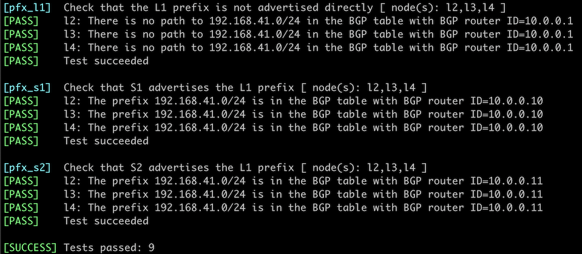

# Use BGP Route Reflectors

In the *[Build a Transit Network with IBGP](2-transit.md)* lab exercise, you learned the basics of IBGP, including the need to have a full mesh of IBGP sessions between all BGP-speaking routers in an autonomous system.

The original BGP protocol (defined in [RFC 4271](https://datatracker.ietf.org/doc/html/rfc4271)) needed a full mesh of IBGP sessions because it had no attribute that could be used to detect routing loops within an autonomous system (AS path is used between autonomous systems). *BGP Route Reflection* feature (defined in [RFC 4456](https://datatracker.ietf.org/doc/html/rfc4456)) adds the extra attributes needed for intra-AS loop detection and allows you to build large networks with a hub-and-spoke topology of IBGP sessions. That's what you'll practice in this lab exercise.

## Lab Topology

You'll work with a slightly larger lab containing six routers connected into a leaf-and-spine fabric:


The following diagram shows the IBGP sessions needed to distribute routing information (IPv4 prefixes of loopback interfaces) between all routers in your network:


During the lab exercise, you'll remove all IBGP sessions between leaf routers and turn spine routers into BGP route reflectors, resulting in the following IBGP sessions:


!!! tip
    Please note there's still an IBGP session between the two spine routers. Removing it would reduce the resiliency of BGP routing in your network.

## Start the Lab

Assuming you already [set up your lab infrastructure](../1-setup.md), change directory to `ibgp/3-rr`

You can choose between these lab topologies:

* `topology.yml`: 6-router topology with a full mesh of IBGP sessions. Start with **netlab up** ([device requirements](#req))
* `hub-spoke.yml`: 6-router topology with hub-and-spoke IBGP sessions. Start with **netlab up hub-spoke.yml**.
* `4-router.yml`: 4-router topology (two leaves, two spines) with hub-and-spoke IBGP sessions and FRRouting running on the leaf routers. Use this topology when you're low on memory; start it with **netlab up 4-router.yml**.

After starting the lab, log into lab devices with **netlab connect** and verify that _netlab_ correctly configured their IP addresses, OSPF routing, and EBGP sessions.

## Lab Configuration

_netlab_ will configure IP addressing, OSPF, and a full mesh of IBGP sessions on the lab devices.

**BGP router identifiers and advertised prefixes**

| Node/ASN | Router ID | Advertised prefixes |
|----------|----------:|--------------------:|
| **AS65000** ||
| l1 | 10.0.0.1 | 192.168.41.0/24 |
| l2 | 10.0.0.2 | 192.168.42.0/24 |
| l3 | 10.0.0.3 | 192.168.43.0/24 |
| l4 | 10.0.0.4 | 192.168.44.0/24 |
| s1 | 10.0.0.10 |  |
| s2 | 10.0.0.11 |  |

**BGP neighbors (6-router topology)**

| Node | Router ID /<br />Neighbor | Router AS/<br />Neighbor AS | Neighbor IPv4 |
|------|---------------------------|----------------------------:|--------------:|
| **l1** | 10.0.0.1 | 65000 |
| | l2 | 65000 | 10.0.0.2 |
| | l3 | 65000 | 10.0.0.3 |
| | l4 | 65000 | 10.0.0.4 |
| | s1 | 65000 | 10.0.0.10 |
| | s2 | 65000 | 10.0.0.11 |
| **l2** | 10.0.0.2 | 65000 |
| | l1 | 65000 | 10.0.0.1 |
| | l3 | 65000 | 10.0.0.3 |
| | l4 | 65000 | 10.0.0.4 |
| | s1 | 65000 | 10.0.0.10 |
| | s2 | 65000 | 10.0.0.11 |
| **l3** | 10.0.0.3 | 65000 |
| | l1 | 65000 | 10.0.0.1 |
| | l2 | 65000 | 10.0.0.2 |
| | l4 | 65000 | 10.0.0.4 |
| | s1 | 65000 | 10.0.0.10 |
| | s2 | 65000 | 10.0.0.11 |
| **l4** | 10.0.0.4 | 65000 |
| | l1 | 65000 | 10.0.0.1 |
| | l2 | 65000 | 10.0.0.2 |
| | l3 | 65000 | 10.0.0.3 |
| | s1 | 65000 | 10.0.0.10 |
| | s2 | 65000 | 10.0.0.11 |
| **s1** | 10.0.0.10 | 65000 |
| | l1 | 65000 | 10.0.0.1 |
| | l2 | 65000 | 10.0.0.2 |
| | l3 | 65000 | 10.0.0.3 |
| | l4 | 65000 | 10.0.0.4 |
| | s2 | 65000 | 10.0.0.11 |
| **s2** | 10.0.0.11 | 65000 |
| | l1 | 65000 | 10.0.0.1 |
| | l2 | 65000 | 10.0.0.2 |
| | l3 | 65000 | 10.0.0.3 |
| | l4 | 65000 | 10.0.0.4 |
| | s1 | 65000 | 10.0.0.10 |

## Cutting the Mesh

Log into L4 and inspect its BGP table. It should contain four prefixes (each leaf router advertises a BGP prefix). This is the printout you'd get when using FRRouting containers:

Original BGP table on L4
{.code-caption}
```
l4# show ip bgp
BGP table version is 4, local router ID is 10.0.0.4, vrf id 0
Default local pref 100, local AS 65000
Status codes:  s suppressed, d damped, h history, * valid, > best, = multipath,
               i internal, r RIB-failure, S Stale, R Removed
Nexthop codes: @NNN nexthop's vrf id, < announce-nh-self
Origin codes:  i - IGP, e - EGP, ? - incomplete
RPKI validation codes: V valid, I invalid, N Not found

    Network          Next Hop            Metric LocPrf Weight Path
 *>i192.168.41.0/24  10.0.0.1(l1)             0    100      0 i
 *>i192.168.42.0/24  10.0.0.2(l2)             0    100      0 i
 *>i192.168.43.0/24  10.0.0.3(l3)             0    100      0 i
 *> 192.168.44.0/24  0.0.0.0(l4)              0         32768 i

Displayed 4 routes and 4 total paths
```

Next, log into all leaf routers and remove IBGP sessions with other leaf routers. After completing this part of the exercise, you should have two BGP neighbors on every leaf router.

!!! Tip
    If you don't like the extra practice, start the `hub-spoke.yml` lab topology.

You'll also notice that L4 no longer knows how to reach the other leaf switches:

The BGP table on L4 no longer contains other leaf prefixes
{.code-caption}
```
l4# show ip bgp
BGP table version is 7, local router ID is 10.0.0.4, vrf id 0
Default local pref 100, local AS 65000
Status codes:  s suppressed, d damped, h history, * valid, > best, = multipath,
               i internal, r RIB-failure, S Stale, R Removed
Nexthop codes: @NNN nexthop's vrf id, < announce-nh-self
Origin codes:  i - IGP, e - EGP, ? - incomplete
RPKI validation codes: V valid, I invalid, N Not found

    Network          Next Hop            Metric LocPrf Weight Path
 *> 192.168.44.0/24  0.0.0.0(l4)              0         32768 i

Displayed 1 routes and 1 total paths
```

## Adding Route Reflectors

Reducing the number of IBGP sessions in our network is good, but we still need full connectivity between leaf routers. You could  advertise the default route or an aggregate prefix from the spine routers ([try it out](#alt)); we'll turn them into route reflectors:

* Configure IBGP neighbors to be *route reflector clients* on both spine routers. **neighbor route-reflector-client** is a typical configuration command you would use.

## Verification

Log into L4 and inspect its BGP table. As both route reflectors (S1 and S2) send IBGP routes to L4, you should see two copies of every leaf prefix:

BGP table on L4 after the introduction of route reflectors
{.code-caption}
```
l4# show ip bgp
BGP table version is 13, local router ID is 10.0.0.4, vrf id 0
Default local pref 100, local AS 65000
Status codes:  s suppressed, d damped, h history, * valid, > best, = multipath,
               i internal, r RIB-failure, S Stale, R Removed
Nexthop codes: @NNN nexthop's vrf id, < announce-nh-self
Origin codes:  i - IGP, e - EGP, ? - incomplete
RPKI validation codes: V valid, I invalid, N Not found

    Network          Next Hop            Metric LocPrf Weight Path
 *>i192.168.41.0/24  10.0.0.1(s1)             0    100      0 i
 * i                 10.0.0.1(s2)             0    100      0 i
 *>i192.168.42.0/24  10.0.0.2(s1)             0    100      0 i
 * i                 10.0.0.2(s2)             0    100      0 i
 *>i192.168.43.0/24  10.0.0.3(s1)             0    100      0 i
 * i                 10.0.0.3(s2)             0    100      0 i
 *> 192.168.44.0/24  0.0.0.0(l4)              0         32768 i

Displayed 4 routes and 7 total paths
```

Some devices (including Arista EOS) will also show additional BGP attributes attached to reflected routes (ORIGINATOR_ID and CLUSTER_LIST). Alternatively, you can inspect a single BGP prefix on most network devices to see the route reflection-related attributes:

The details of the BGP prefix advertised by L1 as seen by L4
{.code-caption}
```
l4# show ip bgp 192.168.41.0/24
BGP routing table entry for 192.168.41.0/24, version 11
Paths: (2 available, best #1, table default)
  Not advertised to any peer
  Local
    10.0.0.1(s1) (metric 20) from s1(10.0.0.10) (10.0.0.1)
      Origin IGP, metric 0, localpref 100, valid, internal, bestpath-from-AS Local, best (Neighbor IP)
      Originator: 10.0.0.1, Cluster list: 10.0.0.10
      Last update: Tue Oct  1 19:04:57 2024
  Local
    10.0.0.1(s2) (metric 20) from s2(10.0.0.11) (10.0.0.1)
      Origin IGP, metric 0, localpref 100, valid, internal
      Originator: 10.0.0.1, Cluster list: 10.0.0.11
      Last update: Tue Oct  1 19:04:43 2024
```

**Next:** 

* [Use BGP session templates](../session/6-templates.md) to make the BGP configuration on the BGP route reflectors scalable.
* Configure a [BGP Route Server](../session/5-routeserver.md) -- functionality similar to BGP Route Reflectors, but for EBGP sessions.

## Automated Verification

You can use the **netlab validate** command if you've installed *netlab* release 1.8.3 or later and use Cumulus Linux, FRR, or Arista EOS on leaf devices. The validation tests check:

* Whether the leaf devices get BGP prefixes directly from other leaf devices (you forgot to remove the leaf-to-leaf IBGP sessions)
* Whether the leaf devices get BGP prefixes from both spine devices (spine devices work as route reflectors).

This is the printout validating the L1 prefix[^CTL]:

[^CTL]: The complete validation results are too long to include in the lab description.



## Alternate Solutions {#alt}

Your lab uses a very structured addressing scheme, so you can advertise an aggregate prefix (for example, `192.168.0.0/16`) from the spine routers to fix the routing in your lab. You could advertise the default route from the spine routers in a less structured lab.

You can easily try out both solutions:

* Start the `hub-spoke.yml` lab topology with **netlab up hub-spoke.yml**
* Configure an aggregate prefix on both spine routers (see [BGP Route Aggregation](../basic/8-aggregate.md) exercise for more details) or configure default route advertisement on spine routers with a configuration command similar to **neighbor default-originate always**.

## Reference Information

### Device Requirements {#req}

* Use any device [supported by the _netlab_ BGP and OSPF configuration modules](https://netlab.tools/platforms/#platform-routing-support) as leaf- or spine routers.
* You can do automated lab validation with Arista EOS, Cumulus Linux, or FRR running on leaf devices. Automated lab validation requires _netlab_ release 1.8.3 or higher.

### Lab Wiring 

**6-router topology**

| Origin Device | Origin Port | Destination Device | Destination Port |
|---------------|-------------|--------------------|------------------|
| l1 | eth1 | s1 | eth1 |
| l1 | eth2 | s2 | eth1 |
| l2 | eth1 | s1 | eth2 |
| l2 | eth2 | s2 | eth2 |
| l3 | eth1 | s1 | eth3 |
| l3 | eth2 | s2 | eth3 |
| l4 | eth1 | s1 | eth4 |
| l4 | eth2 | s2 | eth4 |

**4-router topology**

| Link Name       | Origin Device | Origin Port | Destination Device | Destination Port |
|-----------------|---------------|-------------|--------------------|------------------|
| S1-L1 | s1 | Ethernet1 | l1 | swp1 |
| S1-L2 | s1 | Ethernet2 | l2 | swp1 |
| Unused link | l1 | swp2 | l2 | swp2 |
| S2-L1 | s2 | Ethernet1 | l1 | swp3 |
| S2-L2 | s2 | Ethernet2 | l2 | swp3 |
| Unused link | s1 | Ethernet3 | s2 | Ethernet3 |

**Note**: Some interfaces are not used to conform with the predefined 4-router lab topology.

### Lab Addressing

**6-router topology**

| Node/Interface | IPv4 Address | IPv6 Address | Description |
|----------------|-------------:|-------------:|-------------|
| **l1** |  10.0.0.1/32 |  | Loopback |
| eth1 | 10.1.0.1/30 |  | l1 -> s1 |
| eth2 | 10.1.0.5/30 |  | l1 -> s2 |
| **l2** |  10.0.0.2/32 |  | Loopback |
| eth1 | 10.1.0.9/30 |  | l2 -> s1 |
| eth2 | 10.1.0.13/30 |  | l2 -> s2 |
| **l3** |  10.0.0.3/32 |  | Loopback |
| eth1 | 10.1.0.17/30 |  | l3 -> s1 |
| eth2 | 10.1.0.21/30 |  | l3 -> s2 |
| **l4** |  10.0.0.4/32 |  | Loopback |
| eth1 | 10.1.0.25/30 |  | l4 -> s1 |
| eth2 | 10.1.0.29/30 |  | l4 -> s2 |
| **s1** |  10.0.0.10/32 |  | Loopback |
| eth1 | 10.1.0.2/30 |  | s1 -> l1 |
| eth2 | 10.1.0.10/30 |  | s1 -> l2 |
| eth3 | 10.1.0.18/30 |  | s1 -> l3 |
| eth4 | 10.1.0.26/30 |  | s1 -> l4 |
| **s2** |  10.0.0.11/32 |  | Loopback |
| eth1 | 10.1.0.6/30 |  | s2 -> l1 |
| eth2 | 10.1.0.14/30 |  | s2 -> l2 |
| eth3 | 10.1.0.22/30 |  | s2 -> l3 |
| eth4 | 10.1.0.30/30 |  | s2 -> l4 |

**4-router topology**

| Node/Interface | IPv4 Address | IPv6 Address | Description |
|----------------|-------------:|-------------:|-------------|
| **l1** |  10.0.0.1/32 |  | Loopback |
| swp1 | 10.1.0.1/30 |  | S1-L1 |
| swp2 |  |  | Unused link |
| swp3 | 10.1.0.9/30 |  | S2-L1 |
| **l2** |  10.0.0.2/32 |  | Loopback |
| swp1 | 10.1.0.5/30 |  | S1-L2 |
| swp2 |  |  | Unused link |
| swp3 | 10.1.0.13/30 |  | S2-L2 |
| **s1** |  10.0.0.10/32 |  | Loopback |
| Ethernet1 | 10.1.0.2/30 |  | S1-L1 |
| Ethernet2 | 10.1.0.6/30 |  | S1-L2 |
| Ethernet3 |  |  | Unused link |
| **s2** |  10.0.0.11/32 |  | Loopback |
| Ethernet1 | 10.1.0.10/30 |  | S2-L1 |
| Ethernet2 | 10.1.0.14/30 |  | S2-L2 |
| Ethernet3 |  |  | Unused link |

**Note**: Some interfaces are not configured with IP addresses to conform with the predefined 4-router lab topology.

