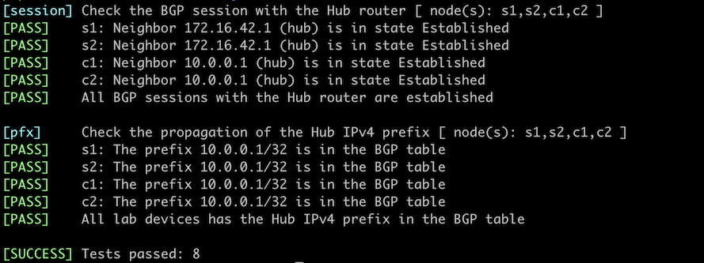

# Dynamic BGP Peers

Unless you have a fully automated network provisioning system, configuring BGP neighbors on routers with hundreds or thousands of neighbors can become cumbersome. Fortunately, most BGP implementations support *dynamic peers*; when configuring them on a BGP router, it accepts any incoming TCP session on port 179 as long as it matches an IP prefix, an IP access-control list, or a prefix list.

!!! Warning
    When deployed incorrectly, dynamic BGP peers could become a huge security risk. Use BGP security mechanisms like MD5 passwords and GTSM to stop an intruder from connecting to your BGP router from outside of your network.

Dynamic BGP peers make sense in these scenarios:

* Route reflectors with many clients,
* Route servers,
* Hubs in large VPN deployments,
* Leaf switches running BGP with servers or virtual machines.

In this lab exercise, you'll configure two types of dynamic peers on a hub router: EBGP peers (spoke sites) and IBGP peers (core routers). We'll use the same BGP AS number on all spoke sites (see [Reuse a BGP AS Number Across Multiple Sites](1-allowas_in.md) for an explanation of that design decision).


## Existing Device Configuration

The routers in your lab use the following BGP AS numbers. The external routers and the hub router advertise IPv4 prefixes.

| Node/ASN | Router ID | Advertised prefixes |
|----------|----------:|--------------------:|
| **AS65000** ||
| c1 | 10.0.0.4 |  |
| c2 | 10.0.0.5 |  |
| hub | 10.0.0.1 | 192.168.42.0/24 |
| **AS65100** ||
| s1 | 10.0.0.2 | 10.0.0.2/32 |
| s2 | 10.0.0.3 | 10.0.0.3/32 |

These BGP neighbors are configured in your lab. Please note that the Hub router has no neighbors; you will use the *dynamic BGP neighbors* functionality to establish BGP sessions with all the other lab routers.

| Node | Router ID /<br />Neighbor | Router AS/<br />Neighbor AS | Neighbor IPv4 |
|------|---------------------------|----------------------------:|--------------:|
| **c1** | 10.0.0.4 | 65000 |
| | hub | 65000 | 10.0.0.1 |
| | c2 | 65000 | 10.0.0.5 |
| **c2** | 10.0.0.5 | 65000 |
| | hub | 65000 | 10.0.0.1 |
| | c1 | 65000 | 10.0.0.4 |
| **s1** | 10.0.0.2 | 65100 |
| | hub | 65000 | 172.16.42.1 |
| **s2** | 10.0.0.3 | 65100 |
| | hub | 65000 | 172.16.42.1 |

Hub, C1, and C2 also run OSPF in the backbone area.

## Start the Lab

Assuming you already [set up your lab infrastructure](../1-setup.md):

* Change directory to `session/9-dynamic`
* Execute **netlab up** ([device requirements](#req))
* Log into the Hub router with the **netlab connect hub** command and verify its IP addresses and OSPF neighbors.

## Configuration Tasks

Configuring dynamic BGP neighbors is usually a two-step process:

* Configure a peer group to define the dynamic neighbor's characteristics. In this lab, you'll have to define two peer groups, one for IBGP sessions and another one for EBGP sessions.

!!! tip
    Revisit: 
    
    * [Establish an IBGP Session](../ibgp/1-edge.md) lab if you have a problem configuring IBGP sessions.
    * [BGP Session Templates](6-templates.md) lab if you're struggling with peer groups.
    
    Also, you might have to activate the peer groups for the IPv4 address family.

* Configure the BGP router to accept incoming TCP sessions on port 179 from an IP address range with a configuration command similar to **bgp listen**. You'll have to tie the allowed IP address range to a peer group to tell your router which parameters to use for a dynamic BGP neighbor.

Use the following IP address ranges:

| Address range  | Peer group                  |
|----------------|-----------------------------|
| 10.0.0.0/24    | IBGP sessions               |
| 172.16.42.0/24 | EBGP sessions with AS 65100 |

## Verification

You can use the **netlab validate** command if you've installed *netlab* release 1.8.3 or later and use Arista EOS, Cumulus Linux, or FRR on S1, S2, C1, and C2. The validation tests check:

* The state of the BGP session between those routers and the Hub router.
* Whether those routers receive the loopback IPv4 prefix from the Hub router.



You can also validate your work on the Hub router:

* Check the state of the BGP sessions with a command similar to **show ip bgp summary**. You should see four BGP neighbors, two from AS 65000 and two from AS 65100.

```
$ netlab connect -q hub --show ip bgp sum

IPv4 Unicast Summary:
BGP router identifier 10.0.0.1, local AS number 65000 VRF default vrf-id 0
BGP table version 3
RIB entries 5, using 480 bytes of memory
Peers 4, using 52 KiB of memory
Peer groups 2, using 128 bytes of memory

Neighbor         V         AS   MsgRcvd   MsgSent   TblVer  InQ OutQ  Up/Down State/PfxRcd   PfxSnt Desc
*s1(172.16.42.2) 4      65100        42        43        3    0    0 00:01:52            1        3 FRRouting/10.0.1_git
*s2(172.16.42.3) 4      65100        42        43        3    0    0 00:01:52            1        3 FRRouting/10.0.1_git
*c1(10.0.0.4)    4      65000        44        47        3    0    0 00:02:05            0        3 FRRouting/10.0.1_git
*c2(10.0.0.5)    4      65000        44        47        3    0    0 00:02:04            0        3 FRRouting/10.0.1_git

Total number of neighbors 4
* - dynamic neighbor
4 dynamic neighbor(s), limit 100
```

* Check the BGP table on the Hub router with a command similar to **show ip bgp**. You should see the prefixes advertised by S1 and S2 as well as the local prefix:

```
$ netlab connect -q hub --show ip bgp
BGP table version is 3, local router ID is 10.0.0.1, vrf id 0
Default local pref 100, local AS 65000
Status codes:  s suppressed, d damped, h history, * valid, > best, = multipath,
               i internal, r RIB-failure, S Stale, R Removed
Nexthop codes: @NNN nexthop's vrf id, < announce-nh-self
Origin codes:  i - IGP, e - EGP, ? - incomplete
RPKI validation codes: V valid, I invalid, N Not found

    Network          Next Hop            Metric LocPrf Weight Path
 *> 10.0.0.2/32      172.16.42.2(s1)          0             0 65100 i
 *> 10.0.0.3/32      172.16.42.3(s2)          0             0 65100 i
 *> 192.168.42.0/24  0.0.0.0(hub)             0         32768 i

Displayed 3 routes and 3 total paths
```

## Impact of BGP Session Loss

A router using dynamic BGP neighbors usually removes all neighbor-related information once a BGP session with the neighbor is lost. You can shut down a BGP neighbor on one of the other routers to explore how the hub router reacts to the BGP session loss.

!!! tip
    You can use the **netlab config** command to shut down the BGP session with the Hub router if you're running Cumulus Linux, FRR, or Arista EOS on the other routers:
    
    * Use `netlab config disable --limit C1`[^RC1] to shut down the BGP session
    * Use `netlab config enable --limit C1` to reenable it.

[^RC1]: Replace **C1** with any other node name if needed

For example, after shutting down the BGP session with the Hub router on C1, you could observe the following BGP logging messages on the Hub router running Arista EOS:

```
Bgp: %BGP-3-NOTIFICATION: received from neighbor 10.0.0.4 (VRF default AS 65000) 6/2 (Cease/administrative shutdown) reason:
Bgp: %BGP-5-ADJCHANGE: peer 10.0.0.4 (VRF default AS 65000) old state Established event RecvNotify new state Idle
```

However, even though the BGP log message claims the BGP neighbor is now in the *Idle* state, the neighbor is no longer visible in the list of BGP neighbors (printout from Arista EOS):

```
hub#show ip bgp summary
BGP summary information for VRF default
Router identifier 10.0.0.1, local AS number 65000
Neighbor Status Codes: m - Under maintenance
  Neighbor    V AS           MsgRcvd   MsgSent  InQ OutQ  Up/Down State   PfxRcd PfxAcc
  10.0.0.5    4 65000           1881      2210    0    0 01:33:54 Estab   1      1
  172.16.42.2 4 65100           1832      2146    0    0 01:31:15 Estab   1      1
  172.16.42.3 4 65100           1832      2147    0    0 01:31:15 Estab   1      1
```

!!! warning
    Do not use dynamic BGP neighbors if you want to use BGP operational data (for example, **show** command printouts or SNMP information) to find failed BGP sessions.

## Reference Information

The following information might help you if you plan to build custom lab infrastructure:

### Device Requirements {#req}

* Use any device [supported by the _netlab_ BGP and OSPF configuration modules](https://netlab.tools/platforms/#platform-routing-support) for the lab routers.
* If you run Arista EOS, Cumulus Linux, or FRR on S1, S2, C1, and C2, you can use the **netlab config** command to turn BGP sessions on or off. You will have to do that manually on other devices.
* You can do automated lab validation with Arista EOS, Cumulus Linux, or FRR running on S1, S2, C1, and C2. Automated lab validation requires _netlab_ release 1.8.3 or higher.
* Git repository contains initial device configurations for Cumulus Linux.

### Lab Wiring

**Point-to-Point Links**

| Origin Device | Origin Port | Destination Device | Destination Port |
|---------------|-------------|--------------------|------------------|
| hub | Ethernet2 | c1 | swp1 |
| hub | Ethernet3 | c2 | swp1 |
| c1 | swp2 | c2 | swp2 |

**LAN Links**

| Origin Device | Origin Port | Link Name (NET) | Description          |
|---------------|-------------|-----------------|----------------------|
| hub | Ethernet1 | rs_1 | Carrier Ethernet |
| s1 | swp1 | rs_1 | Carrier Ethernet |
| s2 | swp1 | rs_1 | Carrier Ethernet |

### Lab Addressing

| Node/Interface | IPv4 Address | IPv6 Address | Description |
|----------------|-------------:|-------------:|-------------|
| **c1** |  10.0.0.4/32 |  | Loopback |
| swp1 | 10.1.0.1/30 |  | c1 -> hub |
| swp2 | 10.1.0.9/30 |  | c1 -> c2 |
| **c2** |  10.0.0.5/32 |  | Loopback |
| swp1 | 10.1.0.5/30 |  | c2 -> hub |
| swp2 | 10.1.0.10/30 |  | c2 -> c1 |
| **hub** |  10.0.0.1/32 |  | Loopback |
| Ethernet1 | 172.16.42.1/24 |  | Carrier Ethernet |
| Ethernet2 | 10.1.0.2/30 |  | hub -> c1 |
| Ethernet3 | 10.1.0.6/30 |  | hub -> c2 |
| **s1** |  10.0.0.2/32 |  | Loopback |
| swp1 | 172.16.42.2/24 |  | Carrier Ethernet |
| **s2** |  10.0.0.3/32 |  | Loopback |
| swp1 | 172.16.42.3/24 |  | Carrier Ethernet |
