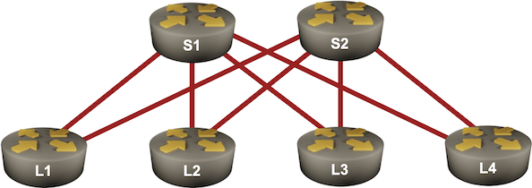

# Use BGP Route Reflectors

In the *[Build a Transit Network with IBGP](2-transit.md)* lab exercise, you learned the basics of IBGP, including the need to have a full mesh of IBGP sessions between all BGP-speaking routers in an autonomous system.

The original BGP protocol (defined in [RFC 4271](https://datatracker.ietf.org/doc/html/rfc4271)) needed a full mesh of IBGP sessions because it had no attribute that could be used to detect routing loops within an autonomous system (AS path is used between autonomous systems). *BGP Route Reflection* feature (defined in [RFC 4456](https://datatracker.ietf.org/doc/html/rfc4456)) adds the extra attributes needed for intra-AS loop detection and allows you to build large networks with a hub-and-spoke topology of IBGP sessions. That's what you'll practice in this lab exercise.

## Lab Topology

You'll work with a slightly larger lab containing six routers connected into a leaf-and-spine fabric:



The following diagram shows the IBGP sessions needed to distribute routing information (IPv4 prefixes of loopback interfaces) between all routers in your network:


During the lab exercise, you'll remove all IBGP sessions between leaf routers and turn spine routers into BGP route reflectors, resulting in the following IBGP sessions:


!!! tip
    Please note there's still an IBGP session between the two spine routers. Removing it would reduce the resiliency of BGP routing in your network.

## Start the Lab

Assuming you already [set up your lab infrastructure](../1-setup.md), change directory to `ibgp/3-rr`

You can choose between these lab topologies:

* `topology.yml`: 6-router topology with a full mesh of IBGP sessions. Start with **netlab up** ([device requirements](#req))
* `hub-spoke.yml`: 6-router topology with hub-and-spoke IBGP sessions. Start with **netlab up hub-spoke.yml**.
* `4-router.yml`: 4-router topology (two leaves, two spines) with hub-and-spoke IBGP sessions and Cumulus Linux running on the leaf routers. Use this topology when you're low on memory; start it with **netlab up 4-router.yml**.

!!! Tip
    If you don't want to use _netlab_, read the *[Run the Lab without netlab](#nonetlab)* section.

After starting the lab, log into lab devices with **netlab connect** and verify that _netlab_ correctly configured their IP addresses, OSPF routing, and EBGP sessions.

## Lab Configuration

_netlab_ will configure IP addressing, OSPF, and a full mesh of IBGP sessions on the lab devices.

| Node/ASN | Router ID | Advertised prefixes |
|----------|----------:|--------------------:|
| **AS65000** ||
| l1 | 10.0.0.1 | 10.0.0.1/32 |
| l2 | 10.0.0.2 | 10.0.0.2/32 |
| l3 | 10.0.0.3 | 10.0.0.3/32 |
| l4 | 10.0.0.4 | 10.0.0.4/32 |
| s1 | 10.0.0.10 | 10.0.0.10/32 |
| s2 | 10.0.0.11 | 10.0.0.11/32 |

| Node | Router ID /<br />Neighbor | Router AS/<br />Neighbor AS | Neighbor IPv4 |
|------|---------------------------|----------------------------:|--------------:|
| **l1** | 10.0.0.1 | 65000 |
| | l2 | 65000 | 10.0.0.2 |
| | l3 | 65000 | 10.0.0.3 |
| | l4 | 65000 | 10.0.0.4 |
| | s1 | 65000 | 10.0.0.10 |
| | s2 | 65000 | 10.0.0.11 |
| **l2** | 10.0.0.2 | 65000 |
| | l1 | 65000 | 10.0.0.1 |
| | l3 | 65000 | 10.0.0.3 |
| | l4 | 65000 | 10.0.0.4 |
| | s1 | 65000 | 10.0.0.10 |
| | s2 | 65000 | 10.0.0.11 |
| **l3** | 10.0.0.3 | 65000 |
| | l1 | 65000 | 10.0.0.1 |
| | l2 | 65000 | 10.0.0.2 |
| | l4 | 65000 | 10.0.0.4 |
| | s1 | 65000 | 10.0.0.10 |
| | s2 | 65000 | 10.0.0.11 |
| **l4** | 10.0.0.4 | 65000 |
| | l1 | 65000 | 10.0.0.1 |
| | l2 | 65000 | 10.0.0.2 |
| | l3 | 65000 | 10.0.0.3 |
| | s1 | 65000 | 10.0.0.10 |
| | s2 | 65000 | 10.0.0.11 |
| **s1** | 10.0.0.10 | 65000 |
| | l1 | 65000 | 10.0.0.1 |
| | l2 | 65000 | 10.0.0.2 |
| | l3 | 65000 | 10.0.0.3 |
| | l4 | 65000 | 10.0.0.4 |
| | s2 | 65000 | 10.0.0.11 |
| **s2** | 10.0.0.11 | 65000 |
| | l1 | 65000 | 10.0.0.1 |
| | l2 | 65000 | 10.0.0.2 |
| | l3 | 65000 | 10.0.0.3 |
| | l4 | 65000 | 10.0.0.4 |
| | s1 | 65000 | 10.0.0.10 |

## Cutting the Mesh

Log into L4 and inspect its BGP table. It should contain six prefixes (loopback addresses of all routers in your lab). This is the printout you'd get when using Arista cEOS containers:

```
l4>show ip bgp
BGP routing table information for VRF default
Router identifier 10.0.0.4, local AS number 65000
Route status codes: s - suppressed contributor, * - valid, > - active, E - ECMP head, e - ECMP
                    S - Stale, c - Contributing to ECMP, b - backup, L - labeled-unicast
                    % - Pending BGP convergence
Origin codes: i - IGP, e - EGP, ? - incomplete
RPKI Origin Validation codes: V - valid, I - invalid, U - unknown
AS Path Attributes: Or-ID - Originator ID, C-LST - Cluster List, LL Nexthop - Link Local Nexthop

          Network                Next Hop              Metric  AIGP       LocPref Weight  Path
 * >      10.0.0.1/32            10.0.0.1              0       -          100     0       i
 * >      10.0.0.2/32            10.0.0.2              0       -          100     0       i
 * >      10.0.0.3/32            10.0.0.3              0       -          100     0       i
 * >      10.0.0.4/32            -                     -       -          -       0       i
 * >      10.0.0.10/32           10.0.0.10             0       -          100     0       i
 * >      10.0.0.11/32           10.0.0.11             0       -          100     0       i
```

Next, log into all leaf routers and remove IBGP sessions with other leaf routers. After completing this part of the exercise, you should have two BGP neighbors on every leaf router.

!!! Tip
    If you don't like the extra practice, start the `hub-spoke.yml` lab topology.

You'll also notice that L4 no longer knows how to reach the loopback interfaces of L1, L2, or L3:

```
l4>show ip bgp
BGP routing table information for VRF default
Router identifier 10.0.0.4, local AS number 65000
Route status codes: s - suppressed contributor, * - valid, > - active, E - ECMP head, e - ECMP
                    S - Stale, c - Contributing to ECMP, b - backup, L - labeled-unicast
                    % - Pending BGP convergence
Origin codes: i - IGP, e - EGP, ? - incomplete
RPKI Origin Validation codes: V - valid, I - invalid, U - unknown
AS Path Attributes: Or-ID - Originator ID, C-LST - Cluster List, LL Nexthop - Link Local Nexthop

          Network                Next Hop              Metric  AIGP       LocPref Weight  Path
 * >      10.0.0.4/32            -                     -       -          -       0       i
 * >      10.0.0.10/32           10.0.0.10             0       -          100     0       i
 * >      10.0.0.11/32           10.0.0.11             0       -          100     0       i
```

## Adding Route Reflectors

Reducing the number of IBGP sessions in our network is good, but we still need full connectivity between leaf routers. You could  advertise the default route or an aggregate prefix from the spine routers ([try it out](#alt)); we'll turn them into route reflectors:

* Configure IBGP neighbors to be *route reflector clients* on both spine routers. **neighbor route-reflector-client** is a typical configuration command you would use.

## Verification

Log into L4 and inspect its BGP table. As both route reflectors (S1 and S2) send IBGP routes to L4, you should see two copies of every loopback prefix. Some devices (including Arista EOS) will also show additional BGP attributes attached to reflected routes (ORIGINATOR_ID and CLUSTER_LIST):

```
l4#show ip bgp
BGP routing table information for VRF default
Router identifier 10.0.0.4, local AS number 65000
Route status codes: s - suppressed contributor, * - valid, > - active, E - ECMP head, e - ECMP
                    S - Stale, c - Contributing to ECMP, b - backup, L - labeled-unicast
                    % - Pending BGP convergence
Origin codes: i - IGP, e - EGP, ? - incomplete
RPKI Origin Validation codes: V - valid, I - invalid, U - unknown
AS Path Attributes: Or-ID - Originator ID, C-LST - Cluster List, LL Nexthop - Link Local Nexthop

          Network                Next Hop              Metric  AIGP       LocPref Weight  Path
 * >      10.0.0.1/32            10.0.0.1              0       -          100     0       i Or-ID: 10.0.0.1 C-LST: 10.0.0.10
 *        10.0.0.1/32            10.0.0.1              0       -          100     0       i Or-ID: 10.0.0.1 C-LST: 10.0.0.11
 * >      10.0.0.2/32            10.0.0.2              0       -          100     0       i Or-ID: 10.0.0.2 C-LST: 10.0.0.10
 *        10.0.0.2/32            10.0.0.2              0       -          100     0       i Or-ID: 10.0.0.2 C-LST: 10.0.0.11
 * >      10.0.0.3/32            10.0.0.3              0       -          100     0       i Or-ID: 10.0.0.3 C-LST: 10.0.0.10
 *        10.0.0.3/32            10.0.0.3              0       -          100     0       i Or-ID: 10.0.0.3 C-LST: 10.0.0.11
 * >      10.0.0.4/32            -                     -       -          -       0       i
 * >      10.0.0.10/32           10.0.0.10             0       -          100     0       i
 *        10.0.0.10/32           10.0.0.10             0       -          100     0       i Or-ID: 10.0.0.10 C-LST: 10.0.0.11
 * >      10.0.0.11/32           10.0.0.11             0       -          100     0       i
 *        10.0.0.11/32           10.0.0.11             0       -          100     0       i Or-ID: 10.0.0.11 C-LST: 10.0.0.10
```

You can inspect a single BGP prefix to see the route reflection-related attributes on most network devices:

```
l4#show ip bgp 10.0.0.1
BGP routing table information for VRF default
Router identifier 10.0.0.4, local AS number 65000
BGP routing table entry for 10.0.0.1/32
 Paths: 2 available
  Local
    10.0.0.1 from 10.0.0.10 (10.0.0.10)
      Origin IGP, metric 0, localpref 100, IGP metric 30, weight 0, tag 0
      Received 00:07:01 ago, valid, internal, best
      Originator: 10.0.0.1, Cluster list: 10.0.0.10
      Rx SAFI: Unicast
  Local
    10.0.0.1 from 10.0.0.11 (10.0.0.11)
      Origin IGP, metric 0, localpref 100, IGP metric 30, weight 0, tag 0
      Received 00:06:43 ago, valid, internal
      Originator: 10.0.0.1, Cluster list: 10.0.0.11
      Rx SAFI: Unicast
```

## Alternate Solutions {#alt}

Your lab uses a very structured addressing scheme, so you can advertise an aggregate prefix (for example, `10.0.0.0/24`) from the spine routers to fix the routing in your lab. You could advertise the default route from the spine routers in a less structured lab.

You can easily try out both solutions:

* Start the `hub-spoke.yml` lab topology with **netlab up hub-spoke.yml**
* Configure an aggregate prefix on both spine routers (see [BGP Route Aggregation](../basic/8-aggregate.md) exercise for more details) or configure default route advertisement on spine routers with a configuration command similar to **neighbor default-originate always**.

## Reference Information

### Device Requirements {#req}

* Use any device [supported by the _netlab_ BGP and OSPF configuration modules](https://netlab.tools/platforms/#platform-routing-support) as leaf- or spine routers.

### Run the Lab without _netlab_ {#nonetlab}

You can run this lab on any [virtual lab infrastructure](../external/index.md) conforming to the [four router lab topology](../external/4-router.md) -- your devices (S1, S2) will be spine routers;  leaf routers (L1, L2) will run Cumulus Linux.

The leaf router configurations are in the `ibgp/3-rr/config` directory. You'll have to configure the spine routers yourself.

Use the following information if you decide to do that[^NM]:

[^NM]: I wouldn't, but that's just me.

#### Lab Wiring

| Link Name       | Origin Device | Origin Port | Destination Device | Destination Port |
|-----------------|---------------|-------------|--------------------|------------------|
| S1-L1 | s1 | Ethernet1 | l1 | swp1 |
| S1-L2 | s1 | Ethernet2 | l2 | swp1 |
| Unused link | l1 | swp2 | l2 | swp2 |
| S2-L1 | s2 | Ethernet1 | l1 | swp3 |
| S2-L2 | s2 | Ethernet2 | l2 | swp3 |
| Unused link | s1 | Ethernet3 | s2 | Ethernet3 |

**Note**: Some interfaces are not used to conform with the predefined 4-router lab topology.

#### Lab Addressing

| Node/Interface | IPv4 Address | IPv6 Address | Description |
|----------------|-------------:|-------------:|-------------|
| **l1** |  10.0.0.1/32 |  | Loopback |
| swp1 | 10.1.0.1/30 |  | S1-L1 |
| swp2 |  |  | Unused link |
| swp3 | 10.1.0.9/30 |  | S2-L1 |
| **l2** |  10.0.0.2/32 |  | Loopback |
| swp1 | 10.1.0.5/30 |  | S1-L2 |
| swp2 |  |  | Unused link |
| swp3 | 10.1.0.13/30 |  | S2-L2 |
| **s1** |  10.0.0.10/32 |  | Loopback |
| Ethernet1 | 10.1.0.2/30 |  | S1-L1 |
| Ethernet2 | 10.1.0.6/30 |  | S1-L2 |
| Ethernet3 |  |  | Unused link |
| **s2** |  10.0.0.11/32 |  | Loopback |
| Ethernet1 | 10.1.0.10/30 |  | S2-L1 |
| Ethernet2 | 10.1.0.14/30 |  | S2-L2 |
| Ethernet3 |  |  | Unused link |

**Note**: Some interfaces are not configured with IP addresses to conform with the predefined 4-router lab topology.

