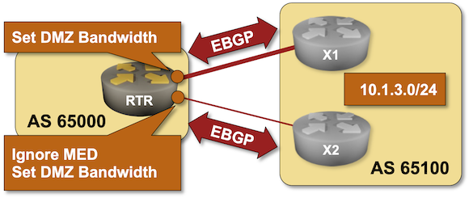

# EBGP Load Balancing with DMZ Bandwidth

In the previous exercise, you configured Equal-Cost Multipathing (ECMP) between EBGP paths. ECMP results in your router sending approximately the same amount of traffic across all equal-cost links. That approach does not work well when you use paths with different bandwidths, in which case you need *Unequal-Cost Multipathing* (UCMP).

Most BGP implementations support the *DMZ Bandwidth* extended BGP community, which can influence the load balancing ratios across links with unequal bandwidth.

In this lab exercise, you'll ignore the Multi-Exit Discriminator metric the adjacent autonomous system uses to tell you to avoid the slower link and configure DMZ bandwidth to send less traffic over it than over the faster link.

!!! Tip
    This lab is still under development. Follow [blog.ipspace.net](https://blog.ipspace.net/) or [Ivan Pepelnjak on LinkedIn](https://www.linkedin.com/in/ivanpepelnjak/) to find out when it will be ready.