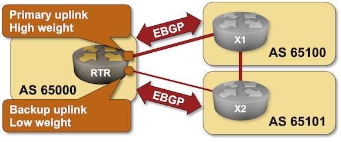

# Select Preferred EBGP Peer with Weights

In the previous lab exercises you [configured EBGP sessions](../basic/2-multihomed.md) with two routers belonging to upstream ISPs and [advertised your IPv4 prefixes to them](../basic/3-originate.md).

Now imagine that you want to use one of the uplinks just for backup purposes -- it might be either too slow or too expensive for regular use.



In this lab, you'll modify your BGP configuration to ensure your router always prefers routes advertised by X1 (ISP-1).

## Existing BGP Configuration

The routers in your lab use the following BGP AS numbers. Each autonomous system advertises one loopback address and another IPv4 prefix. Upstream router also advertise the default route to you.

| Node/ASN | Router ID | BGP RR | Advertised prefixes |
|----------|----------:|--------|--------------------:|
| AS65000 |||
| rtr | 10.0.0.1 |  | 10.0.0.1/32<br>192.168.42.0/24 |
| AS65100 |||
| x1 | 10.0.0.10 |  | 10.0.0.10/32<br>192.168.100.0/24 |
| AS65101 |||
| x2 | 10.0.0.11 |  | 10.0.0.11/32<br>192.168.101.0/24 |

Your device (rtr) has these EBGP neighbors:

| Neighbor | Neighbor IPv4 | Neighbor AS |
|----------|--------------:|------------:|
| x1 | 10.1.0.2 | 65100 |
| x2 | 10.1.0.6 | 65101 |

## Start the Lab

Assuming you already [set up your lab infrastructure](../1-setup.md):

* Change directory to `policy/1-weights`
* Execute **netlab up** ([other options](../2-manual.md))
* Log into your device (RTR) with **netlab connect rtr** and verify IP addresses and BGP configuration.

**Note:** *netlab* will configure IP addressing, EBGP sessions, and BGP prefix advertisements on your router. If you're not using *netlab* just continue with the configuration you made during the [previous exercise](../basic/3-originate.md).

## Configuration Tasks

You want your device to prefer routes advertised by X1 over routes advertised by X2. For example, the route for X2's loopback interface should use X1 as the next hop.

Many BGP implementations use a mechanism called *weight* (usually applied per neighbor) to prefer routes advertised by one of the BGP peers.

If your device supports *BGP weights*, use them to prefer routes advertised by X1. Otherwise, you'll have to use *BGP local preference* to achieve the same result.

## Verification

Examine the BGP table on your router to verify that the routes advertised by X1 (next hop: 10.1.0.2) are the best (active) routes. This is a printout you should get on Arista EOS:

```
rtr#sh ip bgp
BGP routing table information for VRF default
Router identifier 10.0.0.1, local AS number 65000
Route status codes: s - suppressed contributor, * - valid, > - active, E - ECMP head, e - ECMP
                    S - Stale, c - Contributing to ECMP, b - backup, L - labeled-unicast
                    % - Pending BGP convergence
Origin codes: i - IGP, e - EGP, ? - incomplete
RPKI Origin Validation codes: V - valid, I - invalid, U - unknown
AS Path Attributes: Or-ID - Originator ID, C-LST - Cluster List, LL Nexthop - Link Local Nexthop

          Network                Next Hop              Metric  AIGP       LocPref Weight  Path
 * >      0.0.0.0/0              10.1.0.2              0       -          100     200     65100 i
 *        0.0.0.0/0              10.1.0.6              0       -          100     100     65101 i
 * >      10.0.0.1/32            -                     -       -          -       0       i
 * >      10.0.0.10/32           10.1.0.2              0       -          100     200     65100 i
 *        10.0.0.10/32           10.1.0.6              0       -          100     100     65101 65100 i
 * >      10.0.0.11/32           10.1.0.2              0       -          100     200     65100 65101 i
 *        10.0.0.11/32           10.1.0.6              0       -          100     100     65101 i
 * >      192.168.42.0/24        -                     -       -          -       0       ?
 * >      192.168.100.0/24       10.1.0.2              0       -          100     200     65100 i
 *        192.168.100.0/24       10.1.0.6              0       -          100     100     65101 65100 i
 * >      192.168.101.0/24       10.1.0.2              0       -          100     200     65100 65101 i
 *        192.168.101.0/24       10.1.0.6              0       -          100     100     65101 i
```

You could dig deeper and examine the details of an IPv4 prefix originated in AS 65101 (X2), for example 10.0.0.11. Yet again, the next hop of the best path should be X1 (10.1.0.2)

```
rtr#show ip bgp 10.0.0.11
BGP routing table information for VRF default
Router identifier 10.0.0.1, local AS number 65000
BGP routing table entry for 10.0.0.11/32
 Paths: 2 available
  65100 65101
    10.1.0.2 from 10.1.0.2 (10.0.0.10)
      Origin IGP, metric 0, localpref 100, IGP metric 0, weight 200, tag 0
      Received 00:02:47 ago, valid, external, best
      Rx SAFI: Unicast
  65101
    10.1.0.6 from 10.1.0.6 (10.0.0.11)
      Origin IGP, metric 0, localpref 100, IGP metric 0, weight 100, tag 0
      Received 00:02:47 ago, valid, external
      Rx SAFI: Unicast
```

## Reference Information

You might find the following information useful if you're not using _netlab_ to build the lab:

### Lab Wiring

| Link Name       | Origin Device | Origin Port | Destination Device | Destination Port |
|-----------------|---------------|-------------|--------------------|------------------|
|  | rtr | Ethernet1 | x1 | swp1 |
|  | rtr | Ethernet2 | x2 | swp1 |
|  | x1 | swp2 | x2 | swp2 |

### Lab Addressing

| Node/Interface | IPv4 Address | IPv6 Address | Description |
|----------------|-------------:|-------------:|-------------|
| **rtr** |  10.0.0.1/32 |  | Loopback |
| Ethernet1 | 10.1.0.1/30 |  | rtr -> x1 |
| Ethernet2 | 10.1.0.5/30 |  | rtr -> x2 |
| **x1** |  10.0.0.10/32 |  | Loopback |
| swp1 | 10.1.0.2/30 |  | x1 -> rtr |
| swp2 | 10.1.0.9/30 |  | x1 -> x2 |
| **x2** |  10.0.0.11/32 |  | Loopback |
| swp1 | 10.1.0.6/30 |  | x2 -> rtr |
| swp2 | 10.1.0.10/30 |  | x2 -> x1 |
