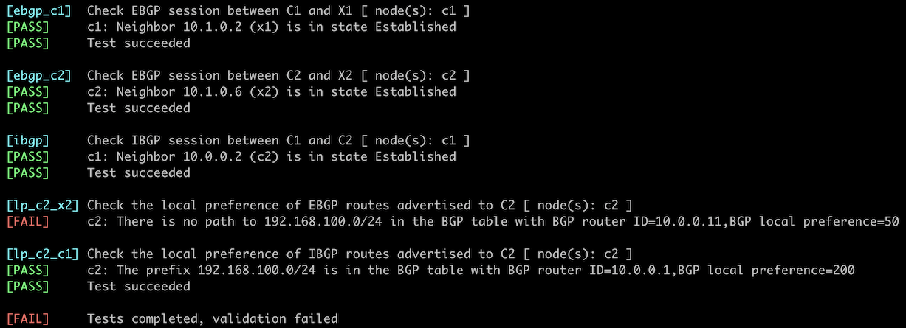

# Select Preferred Uplink with BGP Local Preference

In a previous lab exercise, you [used BGP weights to prefer a high-speed uplink over a low-speed uplink](1-weights.md). That worked well because you had both links attached to the same router. Now, imagine that you have a redundant design with two routers and want to prefer the C1-X1 link over the slower C2-X2 link.


You could use [BGP weights](1-weights.md) to get the job done, but as *weights* aren't a BGP attribute and thus aren't propagated between routers, you'd have to apply them to all BGP sessions on C1 and C2. There's a better way: BGP has the *local preference *attribute that works like weights but gets propagated across IBGP sessions.

In this lab, you'll use BGP local preference to ensure all BGP routers in your network prefer routes received over the C1-X1 link.

## Initial Router Configurations

The routers in your lab use the following BGP AS numbers. Each autonomous system advertises an IPv4 prefix. Upstream routers (x1, x2) also advertise the default route to your router (rtr).

| Node/ASN | Router ID | Advertised prefixes |
|----------|----------:|--------------------:|
| **AS65000** ||
| c1 | 10.0.0.1 | 192.168.42.0/24 |
| c2 | 10.0.0.2 | 192.168.42.0/24 |
| **AS65100** ||
| x1 | 10.0.0.10 | 192.168.100.0/24 |
| x2 | 10.0.0.11 | 192.168.100.0/24 |

Your routers have these BGP neighbors:

| Node | Router ID /<br />Neighbor | Router AS/<br />Neighbor AS | Neighbor IPv4 |
|------|---------------------------|----------------------------:|--------------:|
| **c1** | 10.0.0.1 | 65000 |
| | c2 | 65000 | 10.0.0.2 |
| | x1 | 65100 | 10.1.0.2 |
| **c2** | 10.0.0.2 | 65000 |
| | c1 | 65000 | 10.0.0.1 |
| | x2 | 65100 | 10.1.0.6 |

Your network is also running OSPF in the backbone area:

| Router | Interface | IPv4 Address | Neighbor(s) |
|--------|-----------|-------------:|-------------|
| c1 | Loopback | 10.0.0.1/32 | |
|  | Ethernet3 | 192.168.42.1/24 | c2 |
| c2 | Loopback | 10.0.0.2/32 | |
|  | Ethernet3 | 192.168.42.2/24 | c1 |

## Start the Lab

Assuming you already [set up your lab infrastructure](../1-setup.md):

* Change directory to `policy/5-local-preference`
* Execute **netlab up** ([device requirements](#req), [other options](../external/index.md))
* Log into your devices (C1 and C2) with **netlab connect** and verify their configurations.

**Note:** *netlab* will configure IP addressing, OSPF, BGP, IBGP sessions, EBGP sessions, and BGP prefix advertisements on your routers. You'll have to manually configure your routers if you're not using *netlab*.

## Using BGP Local Preference

The [Border Gateway Protocol 4 (BGP-4)](https://datatracker.ietf.org/doc/html/rfc4271) RFC (RFC 4271) [defines the LOCAL_PREF attribute](https://datatracker.ietf.org/doc/html/rfc4271#page-29) and mandates that:

- All IBGP update messages contain the LOCAL_PREF attribute.
- A BGP speaker never uses the LOCAL_PREF attribute on EBGP updates.
- The LOCAL_PREF attribute influences the selection of BGP best paths (higher local preference is better).

The RFC does not specify how a router sets the BGP local preference or how it influences the BGP best path selection. Most BGP implementations use these defaults to interoperate with older devices:

-   The default value of the LOCAL_PREF attribute that a router adds to EBGP routes before advertising them over IBGP sessions is 100. 
-   LOCAL_PREF is considered very early in the BGP best path selection process (before AS path length). This behavior makes LOCAL_PREF an ideal attribute when implementing a consistent BGP path selection across a whole autonomous system.

We'll use the above behavior to implement a straightforward routing policy:

-   Set the default **local preference **on C1 to 200 (making it better than the built-in default value)
-   Set the default **local preference **on C2 to 50 (making it worse than the built-in default).

Some BGP implementations allow you to change the default local preference value with a configuration command similar to **bgp default local-preference**. If your implementation does not support changing the default LOCAL_PREF value, you'll have to use a routing policy (often called a **route-map**) attached to a BGP neighbor to modify it.

!!! Tip
    If you're using a network device that cannot change the default LOCAL_PREF value (example: Arista EOS), then you're probably already familiar with route maps. You might have been using them in the [Filter Transit Routes](2-stop-transit.md) or [Filter Advertised Prefixes](3-prefix.md) exercises.

!!! Warning
    Applying routing policy parameters to BGP neighbors doesn't necessarily change the BGP table, as the new routing policy might be evaluated only on new incoming updates. You might have to use a command similar to `clear ip bgp * soft in` to tell your router to ask its neighbors to resend their BGP updates.

## Verification

You can use the **netlab validate** command if you've installed *netlab* release 1.8.3 or later and use Cumulus Linux, FRR, or Arista EOS on your router. The validation tests check:

* The state of the EBGP and IBGP sessions.
* The value of BGP local preference for IBGP and EBGP routes received by C2.

This is the printout you could get after configuring C1 but before configuring C2:



You can also examine the BGP table on C2 to verify that the routes advertised by C1 (next hop: 10.0.0.1) have a higher local preference and are preferred over routes received from X1 (next hop: 10.1.0.6). This is a printout you should get on Arista EOS:

```
c2#show ip bgp | begin Network
          Network                Next Hop              Metric  AIGP       LocPref Weight  Path
 * >      0.0.0.0/0              10.0.0.1              0       -          200     0       65100 i
 *        0.0.0.0/0              10.1.0.6              0       -          50      0       65100 i
 * >      192.168.42.0/24        -                     -       -          -       0       i
 *        192.168.42.0/24        10.0.0.1              0       -          100     0       i
 * >      192.168.100.0/24       10.0.0.1              0       -          200     0       65100 i
 *        192.168.100.0/24       10.1.0.6              0       -          50      0       65100 i
```

You could dig deeper and examine the details of an IPv4 prefix that originated in AS 65100, for example, `192.168.100.0/24`:

```
c2#show ip bgp 192.168.100.0/24
BGP routing table information for VRF default
Router identifier 10.0.0.2, local AS number 65000
BGP routing table entry for 192.168.100.0/24
 Paths: 2 available
  65100
    10.0.0.1 from 10.0.0.1 (10.0.0.1)
      Origin IGP, metric 0, localpref 200, IGP metric 20, weight 0, tag 0
      Received 00:03:44 ago, valid, internal, best
      Rx SAFI: Unicast
  65100
    10.1.0.6 from 10.1.0.6 (10.0.0.11)
      Origin IGP, metric 0, localpref 50, IGP metric 0, weight 0, tag 0
      Received 00:33:52 ago, valid, external
      Rx SAFI: Unicast
```

**Next:**

* [Use MED to Influence Incoming Traffic Flow](6-med.md)
* [Using BGP Local Preference in a Complex Routing Policy](a-locpref-route-map.md)

## Reference Information

This lab uses the [4-router lab topology](../external/4-router.md). Some links are unused to retain the interface names from that topology.

The following information might help you if you plan to build custom lab infrastructure:

### Device Requirements {#req}

* Customer routers: use any device [supported by the _netlab_ BGP and OSPF configuration modules](https://netlab.tools/platforms/#platform-routing-support).
* You can do automated lab validation with Arista EOS, Cumulus Linux, or FRR running on the customer router. Automated lab validation requires _netlab_ release 1.8.3 or higher.
* External routers must be [supported by the _netlab_ BGP and OSPF configuration modules](https://netlab.tools/platforms/#platform-routing-support). They also need support for [default route origination](https://netlab.tools/plugins/bgp.session/#platform-support).
* If you want to use a device that is not supported by the **bgp.session** plugin as an external router, remove the **bgp.originate** attributes from the lab topology.
* Git repository contains external router initial device configurations for Cumulus Linux.

### Lab Wiring

| Link Name       | Origin Device | Origin Port | Destination Device | Destination Port |
|-----------------|---------------|-------------|--------------------|------------------|
| Primary uplink | c1 | Ethernet1 | x1 | swp1 |
| Unused link | c1 | Ethernet2 | x2 | swp1 |
| ISP internal link | x1 | swp2 | x2 | swp2 |
| Unused link | c2 | Ethernet1 | x1 | swp3 |
| Backup uplink | c2 | Ethernet2 | x2 | swp3 |
| Customer internal link | c1 | Ethernet3 | c2 | Ethernet3 |

### Lab Addressing

| Node/Interface | IPv4 Address | IPv6 Address | Description |
|----------------|-------------:|-------------:|-------------|
| **c1** |  10.0.0.1/32 |  | Loopback |
| Ethernet1 | 10.1.0.1/30 |  | Primary uplink |
| Ethernet2 |  |  | Unused link |
| Ethernet3 | 192.168.42.1/24 |  | Customer internal link |
| **c2** |  10.0.0.2/32 |  | Loopback |
| Ethernet1 |  |  | Unused link |
| Ethernet2 | 10.1.0.5/30 |  | Backup uplink |
| Ethernet3 | 192.168.42.2/24 |  | Customer internal link |
| **x1** |  10.0.0.10/32 |  | Loopback |
| swp1 | 10.1.0.2/30 |  | Primary uplink |
| swp2 | 192.168.100.10/24 |  | ISP internal link |
| swp3 |  |  | Unused link |
| **x2** |  10.0.0.11/32 |  | Loopback |
| swp1 |  |  | Unused link |
| swp2 | 192.168.100.11/24 |  | ISP internal link |
| swp3 | 10.1.0.6/30 |  | Backup uplink |

