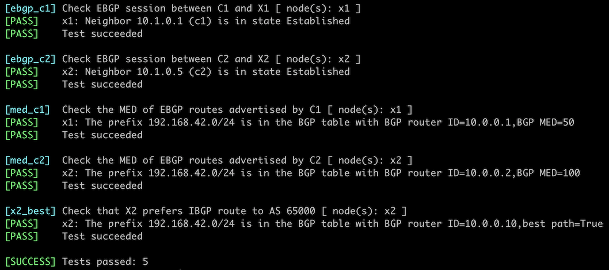

# Use MED to Influence Incoming Traffic Flow

In previous lab exercises, you used [BGP weights](1-weights.md) and [BGP local preference](5-local-preference.md) to change the BGP tables on your routers, thus changing the *outgoing traffic flow*. In this exercise, we'll change the *incoming traffic flow* with the BGP Multi-Exit Discriminator (MED) attribute.


!!! Warning
    Changing incoming traffic flow is more critical for networks that are not content providers. It's also much more challenging than changing the outgoing traffic flow, as you must try to influence the BGP tables on other people's routers.

## Existing Router Configuration

The routers in your lab use the following BGP AS numbers. Each autonomous system advertises an IPv4 prefix. Upstream routers (x1, x2) also advertise the default route to your router (rtr).

| Node/ASN | Router ID | Advertised prefixes |
|----------|----------:|--------------------:|
| **AS65000** (customer) ||
| c1 | 10.0.0.1 | 192.168.42.0/24 |
| c2 | 10.0.0.2 | 192.168.42.0/24 |
| **AS65100** (ISP) ||
| x1 | 10.0.0.10 | 192.168.100.0/24 |
| x2 | 10.0.0.11 | 192.168.100.0/24 |

Your routers have these BGP neighbors:

| Node | Router ID /<br />Neighbor | Router AS/<br />Neighbor AS | Neighbor IPv4 |
|------|---------------------------|----------------------------:|--------------:|
| **c1** | 10.0.0.1 | 65000 |
| | c2 | 65000 | 10.0.0.2 |
| | x1 | 65100 | 10.1.0.2 |
| **c2** | 10.0.0.2 | 65000 |
| | c1 | 65000 | 10.0.0.1 |
| | x2 | 65100 | 10.1.0.6 |

Your network is also running OSPF in the backbone area:

| Router | Interface | IPv4 Address | Neighbor(s) |
|--------|-----------|-------------:|-------------|
| c1 | Loopback | 10.0.0.1/32 | |
|  | Ethernet3 | 192.168.42.1/24 | c2 |
| c2 | Loopback | 10.0.0.2/32 | |
|  | Ethernet3 | 192.168.42.2/24 | c1 |

## Start the Lab

Assuming you already [set up your lab infrastructure](../1-setup.md):

* Change directory to `policy/6-med`
* Execute **netlab up** to start the lab using the usual external devices for X1 and X2 ([device requirements](#req)), or **netlab up single.yml** to start the lab that uses only your chosen devices[^WS]. You can also  [run this lab without using _netlab_](../external/index.md)
* Log into your devices (C1 and C2) with **netlab connect** and verify their configurations.

[^WS]: Using your chosen devices in the ISP network might make it easier to check the status of the BGP tables on X1 and X2. It will also consume more memory (Cumulus Linux and FRR are very memory-efficient).

!!! Tip
    *netlab* will configure IP addressing, OSPF, BGP, IBGP sessions, EBGP sessions, and BGP prefix advertisements on your routers. If you're not using *netlab*, you must manually configure your routers.

## Check the BGP Tables on External Routers

Log into X1 and X2 and check their BGP tables. Use the `sudo vtysh -c 'show ip bgp'` command if you're running Cumulus Linux on external routers:

```
$ netlab connect x1 sudo vtysh -c 'show ip bgp 192.168.42.0'
Connecting to container clab-med-x1, executing sudo vtysh -c "show ip bgp 192.168.42.0"
BGP routing table entry for 192.168.42.0/24
Paths: (2 available, best #2, table default)
  Advertised to non peer-group peers:
  x2(10.0.0.11) 10.1.0.1
  65000
    10.0.0.11 (metric 10) from x2(10.0.0.11) (10.0.0.11)
      Origin IGP, localpref 100, valid, internal
      Last update: Mon Nov  6 07:08:30 2023
  65000
    10.1.0.1 from 10.1.0.1 (10.0.0.1)
      Origin IGP, valid, external, bestpath-from-AS 65000, best (Peer Type)
      Last update: Mon Nov  6 07:08:12 2023
```

```
$ netlab connect x2 sudo vtysh -c 'show ip bgp 192.168.42.0'
Connecting to container clab-med-x2, executing sudo vtysh -c "show ip bgp 192.168.42.0"
BGP routing table entry for 192.168.42.0/24
Paths: (2 available, best #2, table default)
  Advertised to non peer-group peers:
  x1(10.0.0.10) 10.1.0.5
  65000
    10.0.0.10 (metric 10) from x1(10.0.0.10) (10.0.0.10)
      Origin IGP, localpref 100, valid, internal
      Last update: Mon Nov  6 07:08:29 2023
  65000
    10.1.0.5 from 10.1.0.5 (10.0.0.2)
      Origin IGP, valid, external, bestpath-from-AS 65000, best (Peer Type)
      Last update: Mon Nov  6 07:08:11 2023
```

X1 and X2 prefer the EBGP path to the customer prefix (`192.168.42.0/24`) over the IBGP path. The distinction between the two paths is small enough for MED to work.

## Using BGP Multi-Exit Discriminator (MED)

The [Border Gateway Protocol 4 (BGP-4)](https://datatracker.ietf.org/doc/html/rfc4271) RFC (RFC 4271) [defines the MULTI_EXIT_DISC attribute](https://datatracker.ietf.org/doc/html/rfc4271#section-5.1.4) as an optional attribute that is intended to be used on external (inter-AS) links to discriminate among multiple exit or entry points to the same neighboring AS. The first limitation of MED is that it can only influence incoming traffic flow if your network connects to a single upstream network.

RFC 4271 also defines how to use MED: "_All other factors being equal, the exit point with the lower metric SHOULD be preferred._" MED is a weak metric that is considered at the end of the BGP path selection process. You can use it to influence incoming traffic only if the upstream network uses no other routing policy.

Finally, RFC 4271 defines MED propagation rules:

* MED can be used on EBGP sessions.
* If received over EBGP, the MED attribute MAY be propagated over IBGP to other BGP speakers within the same AS.
* The MED attribute received from a neighboring AS MUST NOT be propagated to other neighboring ASes.

We'll use the above behavior to implement a straightforward routing policy:

-   Set the MED on routes advertised from C1 to X1 to 50
-   Set the MED on routes advertised from C2 to X2 to 100 (remember: higher MED is worse).

You will probably have to configure a routing policy (often called a **route-map**) on C1 and C2 to change the MED and then apply the routing policy as the outbound policy on the EBGP neighbors.

!!! Warning
    Applying routing policy parameters to BGP neighbors doesn't necessarily change the BGP table, as the new routing policy might be evaluated only on new incoming updates. You might have to use a command similar to `clear ip bgp * soft` to tell your routers to resend their BGP updates.

## Verification

You can use the **netlab validate** command if you've installed *netlab* release 1.8.3 or later and use Cumulus Linux, FRR, or Arista EOS on X1 and X2. The validation tests check:

* The state of the EBGP sessions.
* Whether C1 advertises the AS 65000 IPv4 prefix (192.168.42.0/24) with BGP MED set to 50.
* Whether C2 advertises the same prefix with BGP MED set to 200.
* Whether X2 prefers the IBGP route to 192.168.42.0/24 over the EBGP route.

This is the printout you should get after completing the lab exercise:



You can also examine the BGP tables on X1 and X2 to verify that the routes from AS 65000 have the desired metric. This is a printout you should get on X2 running Cumulus Linux:

```
$ netlab connect x2 sudo vtysh -c 'show ip bgp 192.168.42.0'
Connecting to container clab-med-x2, executing sudo vtysh -c "show ip bgp 192.168.42.0"
BGP routing table entry for 192.168.42.0/24
Paths: (2 available, best #1, table default)
  Advertised to non peer-group peers:
  10.1.0.5
  65000
    10.0.0.10 (metric 10) from x1(10.0.0.10) (10.0.0.10)
      Origin IGP, metric 50, localpref 100, valid, internal, bestpath-from-AS 65000, best (MED)
      Last update: Mon Nov  6 07:36:36 2023
  65000
    10.1.0.5 from 10.1.0.5 (10.0.0.2)
      Origin IGP, metric 100, valid, external
      Last update: Mon Nov  6 07:36:36 2023
```

X2 has two paths toward `192.168.42.0`:

* IBGP path received from 10.0.0.10 (X1) with metric 50. This is the best path due to MED value.
* EBGP path received from 10.1.0.5 (C2) with metric 100. This is a valid path, but there are better.

If you get a similar printout in your lab, you accomplished your mission -- you managed to change the incoming traffic flow to avoid the C2-X2 link.

!!! Warning
    In real life, you cannot log into other people's routers. In most cases, you're limited to observing the incoming traffic counters on your uplinks and hoping for the best. You might be able to use *looking glasses* (if available) in adjacent networks to inspect their BGP tables or use the *traceroute* tool from a remote vantage point (for example, your laptop tethered to a mobile Internet connection) to check the traffic flow into your network. 

**Next:** [Use AS-Path Prepending to Influence Incoming Traffic Flow](7-prepend.md)

## Reference Information

This lab uses the [4-router lab topology](../external/4-router.md). Some links are unused to retain the interface names from that topology.

The following information might help you if you plan to build custom lab infrastructure:

### Device Requirements {#req}

* Customer routers: use any device [supported by the _netlab_ BGP and OSPF configuration modules](https://netlab.tools/platforms/#platform-routing-support).
* External routers must be [supported by the _netlab_ BGP and OSPF configuration modules](https://netlab.tools/platforms/#platform-routing-support). They also need support for [default route origination](https://netlab.tools/plugins/bgp.session/#platform-support).
* You can do automated lab validation with Arista EOS, Cumulus Linux, or FRR running on external routers. Automated lab validation requires _netlab_ release 1.8.3 or higher.
* If you want to use a device that is not supported by the **bgp.session** plugin as an external router, remove the **bgp.originate** attributes from the lab topology.
* Git repository contains external router initial device configurations for Cumulus Linux.

### Lab Wiring

| Link Name       | Origin Device | Origin Port | Destination Device | Destination Port |
|-----------------|---------------|-------------|--------------------|------------------|
| Primary uplink | c1 | Ethernet1 | x1 | swp1 |
| Unused link | c1 | Ethernet2 | x2 | swp1 |
| ISP internal link | x1 | swp2 | x2 | swp2 |
| Unused link | c2 | Ethernet1 | x1 | swp3 |
| Backup uplink | c2 | Ethernet2 | x2 | swp3 |
| Customer internal link | c1 | Ethernet3 | c2 | Ethernet3 |

### Lab Addressing

| Node/Interface | IPv4 Address | IPv6 Address | Description |
|----------------|-------------:|-------------:|-------------|
| **c1** |  10.0.0.1/32 |  | Loopback |
| Ethernet1 | 10.1.0.1/30 |  | Primary uplink |
| Ethernet2 |  |  | Unused link |
| Ethernet3 | 192.168.42.1/24 |  | Customer internal link |
| **c2** |  10.0.0.2/32 |  | Loopback |
| Ethernet1 |  |  | Unused link |
| Ethernet2 | 10.1.0.5/30 |  | Backup uplink |
| Ethernet3 | 192.168.42.2/24 |  | Customer internal link |
| **x1** |  10.0.0.10/32 |  | Loopback |
| swp1 | 10.1.0.2/30 |  | Primary uplink |
| swp2 | 192.168.100.10/24 |  | ISP internal link |
| swp3 |  |  | Unused link |
| **x2** |  10.0.0.11/32 |  | Loopback |
| swp1 |  |  | Unused link |
| swp2 | 192.168.100.11/24 |  | ISP internal link |
| swp3 | 10.1.0.6/30 |  | Backup uplink |

