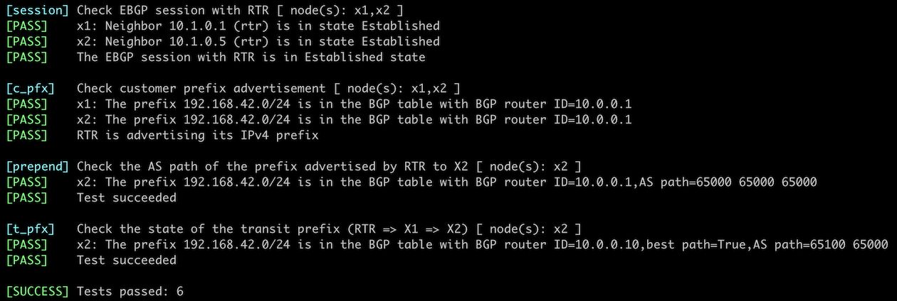

# Use AS-Path Prepending to Influence Incoming Traffic Flow

In the previous lab exercises, you [used BGP Multi-Exit Discriminator](6-med.md) to tell routers in an adjacent autonomous system which link(s) you prefer. That approach no longer works if your BGP router has connections to multiple upstream autonomous systems.

Influencing incoming traffic flow in scenarios with multiple upstream Service Providers is more art than science. The most straightforward tool you can try is AS-path prepending: adding multiple copies of your AS number to the AS path, hoping that the default BGP route selection process in upstream routers results in the desired traffic flow.


In this lab, you'll configure the AS path prepending on the updates sent to X2, trying to persuade X2 to use the path through X1 to reach your network.

## Existing BGP Configuration

The routers in your lab use the following BGP AS numbers. Each autonomous system advertises a single IPv4 prefix.

| Node/ASN | Router ID | Advertised prefixes |
|----------|----------:|--------------------:|
| **AS65000** ||
| rtr | 10.0.0.1 | 192.168.42.0/24 |
| **AS65100** ||
| x1 | 10.0.0.10 | 192.168.100.0/24 |
| **AS65101** ||
| x2 | 10.0.0.11 | 192.168.101.0/24 |

Your router has these EBGP neighbors. _netlab_ configures them automatically; if you're using some other lab infrastructure, you'll have to configure EBGP neighbors and advertised prefixes manually.

| Node | Router ID /<br />Neighbor | Router AS/<br />Neighbor AS | Neighbor IPv4 |
|------|---------------------------|----------------------------:|--------------:|
| **rtr** | 10.0.0.1 | 65000 |
| | x1 | 65100 | 10.1.0.2 |
| | x2 | 65101 | 10.1.0.6 |

## Start the Lab

Assuming you already [set up your lab infrastructure](../1-setup.md):

* Change directory to `policy/7-prepend`
* Execute **netlab up** ([device requirements](#req), [other options](../external/index.md))
* Log into your device (RTR) with **netlab connect rtr** and verify IP addresses and BGP configuration.

**Note:** *netlab* will configure IP addressing, EBGP sessions, and BGP prefix advertisements on your router. If you're not using *netlab*, continue with the configuration you made during the [Advertise IPv4 Prefixes to BGP Neighbors](../basic/3-originate.md) or [Select Preferred EBGP Peer with Weights](1-weights.md) exercises.

## What Do We Have to Fix? {#wtf}

Log into X2 and check its BGP table. Use the `sudo vtysh -c 'show ip bgp'` command if you're running Cumulus Linux on X2:

```
$ netlab connect x2 sudo vtysh -c 'show ip bgp'
Connecting to container clab-prepend-x2, executing sudo vtysh -c "show ip bgp"
BGP table version is 3, local router ID is 10.0.0.11, vrf id 0
Default local pref 100, local AS 65101
Status codes:  s suppressed, d damped, h history, * valid, > best, = multipath,
               i internal, r RIB-failure, S Stale, R Removed
Nexthop codes: @NNN nexthop's vrf id, < announce-nh-self
Origin codes:  i - IGP, e - EGP, ? - incomplete

   Network          Next Hop            Metric LocPrf Weight Path
*  192.168.42.0/24  10.1.0.9                               0 65100 65000 ?
*>                  10.1.0.5                               0 65000 ?
*  192.168.100.0/24 10.1.0.5                               0 65000 65100 i
*>                  10.1.0.9                 0             0 65100 i
*> 192.168.101.0/24 0.0.0.0                  0         32768 i

Displayed  3 routes and 5 total paths
```

As expected, while X2 receives a route to `192.168.42.0/24` from X1, it prefers the one received from your router over the RTR-X2 link. Cumulus Linux explains how it selected the best BGP route in its *detailed BGP prefix information* printout -- in this case, X2 chose the path with the shorter AS-path length:

```
$ netlab connect x2 sudo vtysh -c 'show ip bgp 192.168.42.0'
Connecting to container clab-prepend-x2, executing sudo vtysh -c "show ip bgp 192.168.42.0"
BGP routing table entry for 192.168.42.0/24
Paths: (2 available, best #2, table default)
  Advertised to non peer-group peers:
  10.1.0.5 x1(10.1.0.9)
  65100 65000
    10.1.0.9 from x1(10.1.0.9) (10.0.0.10)
      Origin incomplete, valid, external, bestpath-from-AS 65100
      Last update: Thu Nov  9 09:24:51 2023
  65000
    10.1.0.5 from 10.1.0.5 (10.0.0.1)
      Origin incomplete, valid, external, bestpath-from-AS 65000, best (AS Path)
      Last update: Thu Nov  9 09:24:50 2023
```

## Configuration Tasks

You want X2 to prefer routes to your autonomous system going through X1. As X2 selects the best path based on its AS-path length, you'll artificially increase the length of the AS-path in the updates your router sends to X2. To do that, you'll have to:

-   Create a simple routing policy (often called a **route map**)
-   Configure AS-path prepending in that routing policy. The AS-path X2 receives from X1 has two AS numbers; you'll have to prepend your AS number at least twice to ensure the direct path is worse than the path X2-X1-RTR.
-   Apply the routing policy to the outgoing updates sent from your router to X2.

!!! Warning
    -   Some devices allow you to configure either the number of times they prepend your AS number to the AS path or the content of the AS path. Make sure you won't prepend AS 2 to the AS path.
    -   While you can prepend any AS number to the AS path (assuming your device allows you to specify the content of the AS path), never prepend AS numbers other than your own.
    -   Applying routing policy parameters to BGP neighbors doesn't necessarily change their BGP tables; your router might evaluate the new parameters only when sending new updates. You might have to use a command similar to `clear ip bgp * soft out` to tell your router to resend the BGP updates to its neighbors.

## Verification

You can use the **netlab validate** command if you've installed *netlab* release 1.8.3 or later and use Cumulus Linux, FRR, or Arista EOS on X1 and X2. The validation tests check:

* The state of the EBGP session between RTR and X1/X2.
* The AS path of IPv4 prefix 192.168.42.0/24 advertised to X2 from RTR and X1.
* Whether X2 prefers the transit path through X1 over the direct EBGP path to RTR.

This is the printout you should get after completing the lab exercise:

[](policy-prepend-validate.png)

You can also use the commands from the _[What Do We Have to Fix](#wtf)_ section, log into X2, and verify that it now prefers the route to 192.168.42.0/24 going through X1.

```
$ netlab connect x2 sudo vtysh -c 'show ip bgp 192.168.42.0'
Connecting to container clab-prepend-x2, executing sudo vtysh -c "show ip bgp 192.168.42.0"
BGP routing table entry for 192.168.42.0/24
Paths: (2 available, best #1, table default)
  Advertised to non peer-group peers:
  10.1.0.5 x1(10.1.0.9)
  65100 65000
    10.1.0.9 from x1(10.1.0.9) (10.0.0.10)
      Origin incomplete, valid, external, bestpath-from-AS 65100, best (AS Path)
      Last update: Thu Nov  9 09:24:51 2023
  65000 65000 65000
    10.1.0.5 from 10.1.0.5 (10.0.0.1)
      Origin incomplete, valid, external, bestpath-from-AS 65000
      Last update: Thu Nov  9 10:06:39 2023
```

## Reference Information

This lab uses a subset of the [4-router lab topology](../external/4-router.md). The following information might help you if you plan to build custom lab infrastructure:

### Device Requirements {#req}

* Customer- and external routers: use any device [supported by the _netlab_ BGP and OSPF configuration modules](https://netlab.tools/platforms/#platform-routing-support).
* You can do automated lab validation with Arista EOS, Cumulus Linux, or FRR running on external routers. Automated lab validation requires _netlab_ release 1.8.3 or higher.
* Git repository contains external router initial device configurations for Cumulus Linux.

### Lab Wiring

| Origin Device | Origin Port | Destination Device | Destination Port |
|---------------|-------------|--------------------|------------------|
| rtr | Ethernet1 | x1 | swp1 |
| rtr | Ethernet2 | x2 | swp1 |
| x1 | swp2 | x2 | swp2 |

### Lab Addressing

| Node/Interface | IPv4 Address | IPv6 Address | Description |
|----------------|-------------:|-------------:|-------------|
| **rtr** |  10.0.0.1/32 |  | Loopback |
| Ethernet1 | 10.1.0.1/30 |  | rtr -> x1 |
| Ethernet2 | 10.1.0.5/30 |  | rtr -> x2 |
| **x1** |  192.168.100.1/24 |  | Loopback |
| swp1 | 10.1.0.2/30 |  | x1 -> rtr |
| swp2 | 10.1.0.9/30 |  | x1 -> x2 |
| **x2** |  192.168.101.1/24 |  | Loopback |
| swp1 | 10.1.0.6/30 |  | x2 -> rtr |
| swp2 | 10.1.0.10/30 |  | x2 -> x1 |
