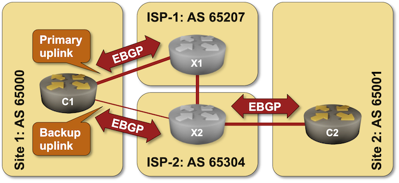
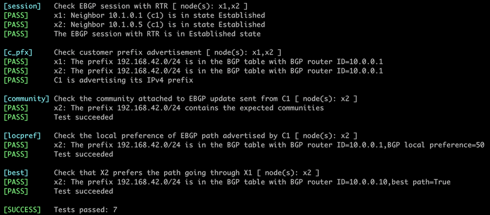

# Attach BGP Communities to Outgoing BGP Updates

In previous lab exercises, you figured out how to nudge an adjacent network to prefer one of the links with the [Multi-Exit Discriminator attribute](6-med.md), and how to push a bit harder with [AS path prepending](7-prepend.md). Sometimes, more than that is needed, and in this lab exercise, you'll have to deal with a scenario in which a Service Provider routing policy interferes strongly with your intentions.

You have two sites. One is connected to two Service Providers (ISP-1 and ISP-2), and the other has only one uplink (to ISP-2). The link from Site-1 to ISP-1 is significantly faster than the alternate link, and you'd like to use it exclusively. The traffic from Site-2 to Site-1 should therefore flow through ISP-2 and ISP-1 (C2→X2→X1→C1)

In this lab, you'll try to influence the Service Provider route selection with AS path prepending and use BGP communities to tell them what changes you'd like them to make to their routing policy.



## Initial Router Configurations

The routers in your lab use the following BGP AS numbers. Each autonomous system advertises an IPv4 prefix.

| Node/ASN | Router ID | Advertised prefixes |
|----------|----------:|--------------------:|
| **AS65000** ||
| c1 | 10.0.0.1 | 192.168.42.0/24 |
| **AS65001** ||
| c2 | 10.0.0.2 | 192.168.37.0/24 |
| **AS65207** ||
| x1 | 10.0.0.10 | 172.17.207.0/24 |
| **AS65304** ||
| x2 | 10.0.0.11 | 172.23.4.0/24 |

Your routers have these BGP neighbors:

| Node | Router ID /<br />Neighbor | Router AS/<br />Neighbor AS | Neighbor IPv4 |
|------|---------------------------|----------------------------:|--------------:|
| **c1** | 10.0.0.1 | 65000 |
| | x1 | 65207 | 10.1.0.2 |
| | x2 | 65304 | 10.1.0.6 |
| **c2** | 10.0.0.2 | 65001 |
| | x2 | 65304 | 10.1.0.14 |

## Start the Lab

Assuming you already [set up your lab infrastructure](../1-setup.md):

* Change directory to `policy/8-community-attach`
* Execute **netlab up** ([device requirements](#req)). You can also [deploy the lab on some other lab infrastructure](../external/index.md).
* Log into your devices (C1 and C2) with **netlab connect** and verify their configurations.

**Note:** *netlab* will configure IP addressing, BGP, EBGP sessions, and BGP prefix advertisements on your routers. If you're not using *netlab*, you must configure your routers manually.

!!! Warning
    This lab requires additional configuration on X2. That configuration is currently available only for Arista EOS, Cumulus Linux, and FRR -- you have to use one of those devices as the external BGP router(s).

## Default Traffic Flow

After starting the lab, log into C2 and examine its BGP table, looking for prefixes advertised by C1. You should get a printout similar to this one (generated on Arista cEOS)[^RAI]:

```
c2>show ip bgp | include 192.168.42.0
 * >      192.168.42.0/24        10.1.0.14             0       -          100     0       65304 65000 ?
```

[^RAI]: I'm using the concise printout of the BGP table (**show ip bgp**) with an output filter to reduce the amount of information you have to sift through. You could also use a command similar to **show ip bgp 192.168.42.0**

As you can see, X2 decided to reach AS 65100 over the direct link. Let's fix that with AS path prepending.

## Configure AS Path Prepending

X2 might select the path through X1 as the best path toward Site-1 (AS 65100) if you inject enough copies of your AS number into the BGP updates C1 sends to X2. Following the procedure outlined in the _[Use AS-Path Prepending to Influence Incoming Traffic Flow](7-prepend.md)_ exercise, extend the AS path of the prefixes C1 sends to X2. If that doesn't work, prepend more copies of your AS to the AS path.

Eventually, you'll figure out that no amount of prepending fixes the problem. X2 stubbornly uses the direct path to Site-1 (X2-C1) even if you prepend many copies of `65000` to the AS path. Here's the relevant printout from C2:

```
c2>show ip bgp | include 192.168.42.0
 * >      192.168.42.0/24        10.1.0.14             0       -          100     0       65304 65000 65000 65000 65000 65000 65000 65000 65000 ?
```

## BGP Communities to the Rescue

It's time to give up and give ISP-2 a call. After enjoying the *on-hold* music for too long and going through too many escalation steps, you might find someone who understands what you're trying to do, pointing you to an online document describing how ISP-2 uses BGP communities. That document might contain a description along these lines[^BCD]:

[^BCD]: Based on [an actual ISP document](https://onestep.net/communities/as7922/)

---

All customer routes received by ISP-2 are assigned a local preference 200. Customers can alter this local preference using the following BGP communities:

| Community	| Local Pref | Effect |
|-----------|-----------:|--------|
| 65304:102 | 190 | Used for customer backup when multi-homed to ISP-2 |
| 65304:101 | 100 | Sets local preference equal to transit routes |
| 65304:100	| 50 | Lowest possible value. Used for backup when multi-homed to multiple providers |

---

It looks like your woes could be fixed by using community 65304:100. Here's what you have to do:

* You already created a routing policy on C1 to implement AS path prepending. If you skipped that step, create a new routing policy (often called a **route map**) on C1. You have already used routing policies in [previous lab exercises](index.md) and should be familiar with them.
* In the routing policy, set the BGP community to `65304:100`
* Attach the routing policy to outgoing updates C1 sends to X2.
* If needed, configure BGP community propagation on C1 with a BGP configuration command similar to **neighbor _address_ send-community**.

!!! Warning
    * Many BGP implementations strip BGP communities from outgoing BGP updates by default. Your routing policy might be perfect, but it will only affect the EBGP updates if you configure BGP community propagation. Even worse, if you use a command like **show ip bgp neighbor _address_ advertised-routes _prefix_**, it might not show the BGP community[^DWA], leading you to the conclusion that your routing policy might be broken.
    * Applying routing policy parameters to BGP neighbors doesn't necessarily change the BGP table, as the new routing policy might be evaluated only on new incoming updates. You might have to use a command similar to `clear ip bgp * soft` to tell your router to resend BGP updates to its neighbors.

[^DWA]: Details are implementation-dependent. I observed this behavior on Arista EOS.

## Verification

You can use the **netlab validate** command if you've installed *netlab* release 1.8.3 or later and use Cumulus Linux, FRR, or Arista EOS on X1 and X2. The validation tests check:

* The state of the EBGP session between RTR and X1/X2.
* Whether C1 is advertising its IPv4 prefix
* Whether C1 attaches the expected community to the EBGP update sent to X2
* Whether X2 lowers the local preference of EBGP path advertised by C1
* Whether X2 prefers the transit path (X2-X1-C1) over the direct path (X2-C1).

This is the printout you should get after completing the lab exercise:

[](policy-c-attach-validate.png)

You can also reexamine the BGP table on C2. If you did everything right, you'd see that X2 changed its mind and now advertises the path through X1 (AS 65207) as the best path:

```
c2>show ip bgp | include 192.168.42.0
 * >      192.168.42.0/24        10.1.0.14             0       -          100     0       65304 65207 65000 ?
```

Want to know how the magic works behind the scenes? Log into X2 and inspect its BGP table. This is how you would do it on Cumulus Linux[^GHU] (this command also comes in handy if you did something wrong and have to figure out what's going on):

[^GHU]: You should also inspect the configuration of X2 to get some hints for one of the upcoming lab exercises.

```
$ netlab connect x2 vtysh -c 'show ip bgp 192.168.42.0'
Connecting to container clab-a_community-x2, executing vtysh -c "show ip bgp 192.168.42.0"
BGP routing table entry for 192.168.42.0/24
Paths: (2 available, best #2, table default)
  Advertised to non peer-group peers:
  10.1.0.5 x1(10.1.0.9) 10.1.0.13
  65000 65000 65000 65000 65000 65000 65000 65000
    10.1.0.5 from 10.1.0.5 (10.0.0.1)
      Origin incomplete, localpref 50, valid, external, bestpath-from-AS 65000
      Community: 65304:100
      Last update: Sat Nov 11 08:42:42 2023
  65207 65000
    10.1.0.9 from x1(10.1.0.9) (10.0.0.10)
      Origin incomplete, valid, external, bestpath-from-AS 65207, best (Local Pref)
      Last update: Sat Nov 11 08:41:49 2023
```

**Next:** 

* [Use No-Export Community to Filter Transit Routes](d-no-export.md)
* [Use BGP Communities in Routing Policies](9-community-use.md)
* [Resolve BGP Wedgies](e-wedgies.md)

## Reference Information

This lab uses the [4-router lab topology](../external/4-router.md). Some links are unused to retain the interface names from that topology.

The following information might help you if you plan to build custom lab infrastructure:

### Device Requirements {#req}

* Customer routers: use any device [supported by the _netlab_ BGP configuration modules](https://netlab.tools/platforms/#platform-routing-support).
* External routers: while you can use any device [supported by the _netlab_ BGP configuration modules](https://netlab.tools/platforms/#platform-routing-support), X2 requires additional configuration that is only available for Arista EOS, Cumulus Linux, and FRR.
* You can do automated lab validation with Arista EOS, Cumulus Linux, or FRR running on external routers. Automated lab validation requires _netlab_ release 1.8.3 or higher.
* Git repository contains external router initial device configurations for Cumulus Linux.

### Lab Wiring

| Link Name       | Origin Device | Origin Port | Destination Device | Destination Port |
|-----------------|---------------|-------------|--------------------|------------------|
| Primary uplink | c1 | Ethernet1 | x1 | swp1 |
| Backup uplink | c1 | Ethernet2 | x2 | swp1 |
| Inter-ISP link | x1 | swp2 | x2 | swp2 |
| Unused link | c2 | Ethernet1 | x1 | swp3 |
| Site 2, uplink 2 | c2 | Ethernet2 | x2 | swp3 |

### Lab Addressing

| Node/Interface | IPv4 Address | IPv6 Address | Description |
|----------------|-------------:|-------------:|-------------|
| **c1** |  10.0.0.1/32 |  | Loopback |
| Ethernet1 | 10.1.0.1/30 |  | Primary uplink |
| Ethernet2 | 10.1.0.5/30 |  | Backup uplink |
| **c2** |  10.0.0.2/32 |  | Loopback |
| Ethernet1 |  |  | Unused link |
| Ethernet2 | 10.1.0.13/30 |  | Site 2 uplink |
| **x1** |  172.17.207.1/24 |  | Loopback |
| swp1 | 10.1.0.2/30 |  | Primary uplink |
| swp2 | 10.1.0.9/30 |  | Inter-ISP link |
| swp3 |  |  | Unused link |
| **x2** |  172.23.4.1/24 |  | Loopback |
| swp1 | 10.1.0.6/30 |  | Backup uplink |
| swp2 | 10.1.0.10/30 |  | Inter-ISP link |
| swp3 | 10.1.0.14/30 |  | Site 2 uplink |
