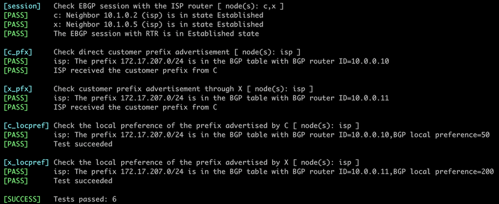

# Use BGP Communities in Routing Policies

In the previous lab exercise, you set a [BGP community on outbound updates](8-community-attach.md) to tell the upstream ISP to reduce its local preference. In this lab, you'll implement the ISP part of that solution: changing the BGP local preference based on the BGP communities attached to incoming BGP routes.


## Initial Router Configurations

The routers in your lab use the following BGP AS numbers. The customer is advertising IPv4 `172.17.207.0/24`.

| Node/ASN | Router ID | Advertised prefixes |
|----------|----------:|--------------------:|
| **AS65000** (your network) ||
| isp | 10.0.0.1 | 10.0.0.1/32 |
| **AS65207** (peer ISP) ||
| x | 10.0.0.11 |  |
| **AS65304** (customer) ||
| c | 10.0.0.10 | 172.17.207.0/24 |

Your router has these BGP neighbors:

| Node | Router ID /<br />Neighbor | Router AS/<br />Neighbor AS | Neighbor IPv4 |
|------|---------------------------|----------------------------:|--------------:|
| **isp** | 10.0.0.1 | 65000 |
| | c | 65304 | 10.1.0.1 |
| | x | 65207 | 10.1.0.6 |

## Start the Lab

Assuming you already [set up your lab infrastructure](../1-setup.md):

* Change directory to `policy/9-community-use`.
* Execute **netlab up** ([device requirements](#req)). You can also [deploy the lab on some other lab infrastructure](../external/index.md).
* Log into your device (ISP) with **netlab connect** and verify its configurations.

!!! Warning
    * *netlab* will configure IP addressing, BGP, EBGP sessions, and BGP prefix advertisements on all devices in your lab. If you're not using *netlab*, use the device configurations supplied in the GitHub repository to configure C and X and configure ISP manually.
    * This lab requires additional configuration on C. That configuration is currently available for Arista EOS, Cumulus Linux, and FRR -- you have to use one of those devices as the external BGP router(s).

## Default Traffic Flow

After starting the lab, log into ISP and examine its BGP table, looking for the IPv4 prefixes advertised by C (`172.17.207.9/24`). You should get a printout similar to this one (generated on Arista cEOS):

```
isp>show ip bgp 172.17.207.0
BGP routing table information for VRF default
Router identifier 10.0.0.1, local AS number 65000
BGP routing table entry for 172.17.207.0/24
 Paths: 2 available
  65304
    10.1.0.1 from 10.1.0.1 (10.0.0.10)
      Origin IGP, metric 0, localpref 100, IGP metric 0, weight 0, tag 0
      Received 00:00:15 ago, valid, external, best
      Community: 65000:50
      Rx SAFI: Unicast
  65207 65304
    10.1.0.6 from 10.1.0.6 (10.0.0.11)
      Origin IGP, metric 0, localpref 100, IGP metric 0, weight 0, tag 0
      Received 00:00:19 ago, valid, external
      Rx SAFI: Unicast
```

As you can see, your router uses the customer's backup link to reach it. Let's fix that: you'll use the BGP community attached to the customer's route (`65000:50`) to reduce its local preference.

## Configure Routing Policy

Configure the following routing policy (inspired by [RFC 1998](https://datatracker.ietf.org/doc/html/rfc1998)) on your router and apply it to BGP updates coming from all its BGP neighbors:

* When a BGP route has a BGP community of `65000:50`, set its local preference to 50.
* Otherwise, set the local preference of a BGP route to 200.

You might have to use configuration commands similar to these to get the job done:

* You have to match BGP communities -- create an object (**ip community-list** or **bgp community-list**) matching BGP community 65000:50.
* Create a routing policy (often called a **route-map**) that uses the community-matching object (a typical command would be **match community**) and sets the local preference to 50 (**set local-preference**).
* Add another item to the routing policy to set the default local preference to 200.
* Apply the routing policy to BGP neighbors with a command similar to **neighbor route-map in**.

!!! Warning
    Applying routing policy parameters to BGP neighbors doesn't necessarily change the BGP table, as the new routing policy might be evaluated only on new incoming updates. You might have to use a command similar to `clear ip bgp * soft in` to tell your BGP neighbors to resend their updates.

## Verification

You can use the **netlab validate** command if you've installed *netlab* release 1.8.3 or later and use Cumulus Linux, FRR, or Arista EOS on your router. The validation tests check:

* The state of the EBGP session between ISP and C/X.
* Whether RTR receives the prefix `172.17.207.1/24` from C and X.
* Whether the prefix received from C has a BGP local preference of 50 and the prefix received from X has a BGP local preference of 200.

This is the printout you should get after completing the lab exercise:

[](policy-c-use-validate.png)

You can also examine the BGP table on the ISP router. If you did everything right, you'd see that the ISP router reduced the local preference of the BGP route received from C and started using the BGP route received from X as the best path toward `172.17.207.0/24`:

```
isp#show ip bgp 172.17.207.0
BGP routing table information for VRF default
Router identifier 10.0.0.1, local AS number 65000
BGP routing table entry for 172.17.207.0/24
 Paths: 2 available
  65207 65304
    10.1.0.6 from 10.1.0.6 (10.0.0.11)
      Origin IGP, metric 0, localpref 200, IGP metric 0, weight 0, tag 0
      Received 00:19:18 ago, valid, external, best
      Rx SAFI: Unicast
  65304
    10.1.0.1 from 10.1.0.1 (10.0.0.10)
      Origin IGP, metric 0, localpref 50, IGP metric 0, weight 0, tag 0
      Received 00:19:14 ago, valid, external
      Community: 65000:50
      Rx SAFI: Unicast
```

## Reference Information

This lab uses a subset of the [4-router lab topology](../external/4-router.md). The following information might help you if you plan to build custom lab infrastructure:

### Device Requirements {#req}

* Use any device [supported by the _netlab_ BGP configuration modules](https://netlab.tools/platforms/#platform-routing-support) for your router (ISP).
* While you can use any device [supported by the _netlab_ BGP configuration modules](https://netlab.tools/platforms/#platform-routing-support) for other lab routers, router C requires additional configuration that is only available for Arista EOS, Cisco IOSv, Cisco IOS XE, Cumulus Linux, and FRR.
* You can do automated lab validation with Arista EOS, Cumulus Linux, or FRR running on the lab routers. Automated lab validation requires _netlab_ release 1.8.3 or higher.
* Git repository contains initial device configurations for Cumulus Linux.

### Lab Wiring

| Link Name       | Origin Device | Origin Port | Destination Device | Destination Port |
|-----------------|---------------|-------------|--------------------|------------------|
| Customer uplink to ISP | isp | Ethernet1 | c | swp1 |
| Link to peer ISP | isp | Ethernet2 | x | swp1 |
| Customer uplink to peer ISP | c | swp2 | x | swp2 |

### Lab Addressing

| Node/Interface | IPv4 Address | IPv6 Address | Description |
|----------------|-------------:|-------------:|-------------|
| **c** |  172.17.207.1/24 |  | Loopback |
| swp1 | 10.1.0.1/30 |  | Customer uplink to ISP |
| swp2 | 10.1.0.9/30 |  | Customer uplink to peer ISP |
| **isp** |  10.0.0.1/32 |  | Loopback |
| Ethernet1 | 10.1.0.2/30 |  | Customer uplink to ISP |
| Ethernet2 | 10.1.0.5/30 |  | Link to peer ISP |
| **x** |  10.0.0.11/32 |  | Loopback |
| swp1 | 10.1.0.6/30 |  | Link to peer ISP |
| swp2 | 10.1.0.10/30 |  | Customer uplink to peer ISP |
