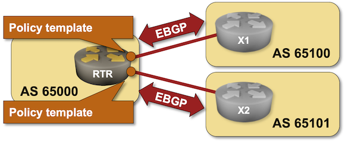

# BGP Policy Templates

Finishing at least some of the [BGP routing policies](../policy/index.md) exercises probably made you realize how many nerd knobs one can attach to a BGP neighbor. Now imagine applying that set of settings to dozens of neighbors you have at an Internet Exchange Point (or to hundreds of customer connections) while making sure the changes in your policy are consistently applied to every neighbor.

While network automation is the obvious answer to the above challenge, you might find *BGP policy templates* (or *BGP groups*) helpful. They allow you to group all relevant BGP settings into a single object and apply them as a group to a BGP neighbor. That's what you'll practice in this lab exercise.

!!! Tip
    This lab is still under development. Follow [blog.ipspace.net](https://blog.ipspace.net/) or [Ivan Pepelnjak on LinkedIn](https://www.linkedin.com/in/ivanpepelnjak/) to find out when it will be ready.