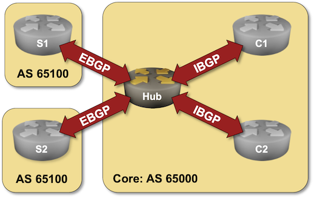

# Dynamic BGP Peers

Unless you have a fully automated network provisioning system, configuring BGP neighbors on routers with hundreds or thousands of neighbors can be cumbersome. Fortunately, most BGP implementations support *dynamic peers*; when configuring them on a BGP router, it accepts any incoming TCP session on port 179 as long as it matches an IP access-control list or a prefix list.

!!! Warning
    When deployed incorrectly, dynamic BGP peers could become a huge security risk. Use BGP security mechanisms like MD5 passwords and GTSM to stop an intruder from connecting to your BGP router from outside of your network.

Dynamic BGP peers make sense in these scenarios:

* Route reflectors with many clients,
* Route servers,
* Hubs in large VPN deployments,
* Leaf switches running BGP with servers or virtual machines.

In this lab exercise, you'll configure two types of dynamic peers on a hub router: EBGP peers (spoke sites) and IBGP peers (core routers). We'll use the same BGP AS number on all spoke sites (see [Reuse a BGP AS Number Across Multiple Sites](1-allowas_in.md) for more details).

!!! Tip
    This lab is still under development. Follow [blog.ipspace.net](https://blog.ipspace.net/) or [Ivan Pepelnjak on LinkedIn](https://www.linkedin.com/in/ivanpepelnjak/) to find out when it will be ready.
